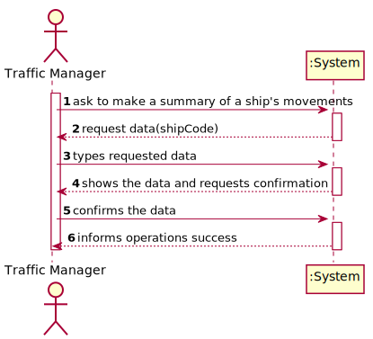
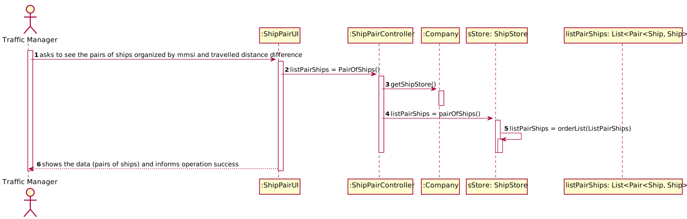

###**Group 45**
* Bruno Ribeiro nº1201000
* Carlos Rodrigues nº1201001
* José Pessoa nº1201007
* Rita Lello nº1201240

##Document Division
This document is divided in different categories, such as:

1. Software Engineering
   1. Use Case Diagram
   2. Requirements Engineering:
      1. System Sequence Diagram (SSD) for each user story
   3. Engineering Analysis:
      1. Domain Model (DM) for the whole project
            1. Excerpts of each user story
   4. Engineering Design:
        1. Class Diagram (CD) for the whole project
            1. Excerpts of each user story
        2. Sequence Diagram (SD) for each user story
        3. Relational Model (Normalised) for the whole project
    
2. Report
   1. Problem Statement
   2. Project Division Organization
   3. Tests
   4. Project Coverage
   5. Pit Test Coverage Report
   6. Team Performance
    
3. README

#Software Engineering
##Use Case Diagram


##Requirements Engineering
###US101 SSD

###US102 SSD

###US103 SSD

###US104 SSD

###US105 SSD

###US106 SSD

###US107 SSD


##Engineering Analysis
###Domain Model


####US101 DM

####US102 DM

####US103 DM

####US104 DM

####US105 DM

####US106 DM

####US107 DM


##Engineering Design
###Class Diagram


####US101 CD

####US102 CD

####US103 CD

####US104 CD

####US105 CD

####US106 CD

####US107 CD


###US101 SD

###US102 SD

###US103 SD

###US104 SD

###US105 SD

###US106 SD

###US107 SD



##Relational Model Normalised


#Report

## Problem Statement
A Cargo shipping company requires a software system to handle their logistics. This company
operates through land and sea, across different continents and has several warehouses spread along the world

##Project Division Organization
| US101 | US102 | US103  | US104  | US105 | US106 |US107 | US108 | US109  | US110  |
|:-------------  |:--------------------- |:------------|:---------------------------- |:------------|:------------|:------------|:------------|:------------|:------------|
| 1201007 |    1201240 | 1201001 | 1201000 | 1201000 | 1201001 | 1201007 1201240 | 1201000 1201001 1201007 1201240 | 1201000 1201001 | 1201007 1201240 |

##Tests
###US101
      @Test
    void readFileNull() throws IOException, ParseException {
        ImportFileController controller = new ImportFileController(App.getInstance().getCompany());
        try {
            controller.read(null);
            Assertions.fail("There should have been an exception");
        } catch (NullPointerException e) {
            e.printStackTrace();
        }
    }

This test verifies if the given file is null.
###US102
      @Test
    void getShipByMMSI() {
        ShipStore shipStore = new ShipStore();
        Ship ship = shipStore.createShip("210950000","VARAMO","IMO9395044","C4SQ2","70","166","25","9.5");
        String mmsi = ship.getMmsi();
        shipStore.saveShipInBST(ship);
        Ship shipResult = shipStore.getShipByMMSI(mmsi);
        Assertions.assertEquals(ship, shipResult);
    }

    @Test
    void getShipByIMO() {
        ShipStore shipStore = new ShipStore();
        Ship ship = shipStore.createShip("210950000","VARAMO","IMO9395044","C4SQ2","70","166","25","9.5");
        String imo = ship.getImo();
        shipStore.saveShipInBST(ship);
        Ship shipResult = shipStore.getShipByIMO(imo);
        Assertions.assertEquals(ship, shipResult);
    }

    @Test
    void getShipByCallSign() {
        ShipStore shipStore = new ShipStore();
        Ship ship = shipStore.createShip("210950000","VARAMO","IMO9395044","C4SQ2","70","166","25","9.5");
        String callSign = ship.getCallsign();
        shipStore.saveShipInBST(ship);
        Ship shipResult = shipStore.getShipByCallSign(callSign);
        Assertions.assertEquals(ship, shipResult);
    }

Each of these tests is going to try and find a ship with either mmsi, imo or call sign.
###US103


###US104
      @Test
    public void testToString() {
        Summary summary = new Summary("210950000", "VARAMO", new Date(999999999), new Date(999999999), "10 horas", 14,15.2, 13.3,12.5,10.8,"8.9554569","45.2484659","9.54946","41.454684",855.0,200.0);
        String expected = String.format("Summary of Ship %s\n\nShip Code = %s\nVessel Name = %s\nStart Base Date Time = %s\nEnd Base Date Time = %s\nTotal Movement Time = %s\nTotal Movements = %d\nMax SOG = %f\nMean SOG = %.2f\nMax COG = %f\nMean COG = %.2f\nDeparture Latitude = %s\nDeparture Longitude = %s\nArrival Latitude = %s\nArrival Longitude = %s\nTravelled Distance = %f Km\nDelta Distance = %f Km", "VARAMO","210950000", "VARAMO", new Date(999999999), new Date(999999999), "10 horas", 14,15.2, 13.3,12.5,10.8,"8.9554569","45.2484659","9.54946","41.454684",855.0,200.0);
        String actual = summary.toString();
        String notExpected = ("Summary of Ship TUSTUMENA\n" +
                "Ship Code= 210950000\n" +
                "Vessel Name= VARAMO\n"  +
                "Start Base Date Time= " + new Date(999999999) + "\n"+
                "End Base Date Time= "  + new Date(999999999) + "\n" +
                "Total Movement Time= 10 horas\n"+
                "Total Movements= 14\n" +
                "Max SOG= " + 15.2 +"\n" +
                "Mean SOG= " + 13.3 +"\n" +
                "Max COG= " + 12.5 +"\n" +
                "Mean COG= " + 10.8 +"\n" +
                "Departure Latitude= " + 8.9554569 +"\n" +
                "Departure Longitude= " + 45.2484659 +"\n" +
                "Arrival Latitude= " + 9.54946 +"\n" +
                "Arrival Longitude= " + 41.454684 +"\n" +
                "Travel Distance= " + 855.0 +"\n" +
                "Delta Distance= " + 200.0);
        Assertions.assertEquals(expected, actual);
        Assertions.assertNotEquals(notExpected, actual);
    }

This test creates a summary and the expected outcome and then compares them.
###US105
      @Test
    void getInformationAllShips() {
        ShipStore store = App.getInstance().getCompany().getshipStore();
        Ship ship = new Ship("210950000","VARAMO","IMO9395044","C4SQ2","70","166","25","9.5");
        store.saveShipInBST(ship);
        try {
            store.addShipPosition("210950000","31/12/2020 17:03","42.92236","-66.97243","12.5","2.4","358","NA","B");
        } catch (ParseException e) {
        }

        ListAllShipsInformationController controller = new ListAllShipsInformationController(App.getInstance().getCompany());

        boolean actual = controller.getInformationAllShips();

        Assertions.assertEquals(true, actual);
    }

Creates a ship and a ship position and verifies if the method is able to get all the ship information.
###US106
      @Test
    void getTopShipsWithTravelledDistance() throws ParseException {
        Company company = new Company();
        ShipStore store = company.getshipStore();
        Ship ship = new Ship("210950000","VARAMO","IMO9395044","C4SQ2","70","166","25","9.5");
        store.saveShipInBST(ship);
        Ship ship2 = new Ship("228339600", "ALMAVIVA","IMO9450648","FLSU","70","334","42","15");
        store.saveShipInBST(ship2);
        store.addShipPosition("210950000","31/12/2020 17:03","42.92236","-66.97243","12.5","2.4","358","NA","B");
        store.addShipPosition("210950000","31/12/2020 16:20","42.7698","-66.9759","13.3","3.7","356","NA","B");
        store.addShipPosition("210950000","31/12/2020 16:32","42.81133","-66.97587","13.4","10","356","NA","B");
        store.addShipPosition("228339600","31/12/2020 01:22","28.19854","-88.65058","11.7","130.3","131","79","B");
        store.addShipPosition("228339600","31/12/2020 03:47","27.89788","-88.25001","11.7","128.4","129","79","B");
        store.addShipPosition("228339600","30/12/2020 00:15","28.34412","-88.84108","12","128.3","129","79","B");

        TopShipsWithTravelledDistanceController controller = new TopShipsWithTravelledDistanceController(company);

        SimpleDateFormat format = new SimpleDateFormat("dd/MM/yyyy");
        Date date = format.parse("31/12/2020");
        Date final_date = format.parse("01/01/2021");
        boolean actual = controller.getTopShipsWithTravelledDistance(date,final_date,3);
        boolean creationError = controller.getTopShipsWithTravelledDistance(null,null,3);
        Assertions.assertEquals(true, actual);
        Assertions.assertEquals(false, creationError);
        Assertions.assertNotEquals(false, actual);
        Assertions.assertNotEquals(true, creationError);
    }

This method Creates ships and calls the method to get the ships with the most travelled distance and verifies if the outcome is correct.
###US107
      @Test
    void pairOfShips() throws ParseException, IOException {
        ShipStore store = App.getInstance().getCompany().getshipStore();
        Ship ship = new Ship("210950000","VARAMO","IMO9395044","C4SQ2","70","166","25","9.5");
        store.saveShipInBST(ship);
        Ship ship1 = new Ship("228339600", "ALMAVIVA","IMO9450648","FLSU","70","334","42","15");
        store.saveShipInBST(ship1);
        store.addShipPosition("210950000","31/12/2020 17:03","20.92236","-20.97243","12.5","2.4","358","NA","B");
        store.addShipPosition("228339600","31/12/2020 17:03","20.90000","-21.0","12.5","2.4","358","NA","B");
        store.addShipPosition("210950000","31/12/2020 17:04","42.92236","-66.97243","12.5","2.4","358","NA","B");
        store.addShipPosition("228339600","31/12/2020 17:04","42.90000","-67.0","12.5","2.4","358","NA","B");
        List<Pair<Ship, Ship>> pair= new ArrayList<Pair<Ship, Ship>>();
        pair.add(new Pair<>(ship1, ship));
        ShipPairController controller = new ShipPairController(App.getInstance().getCompany());
        Assertions.assertEquals(pair, controller.pairOfShips());
    }

This test is going to create a pair of ships and verify if the method pairOfShips returns the same pair

##Project Coverage


##Pit Test Coverage Report


##Team Performance

In the first week of sprint , we were a bit slow because we didn't have the necessary knowledge to carry out the tasks and we weren't aligned in terms of communication yet.

In the second week , while one student did the first US the others were able to analyze the project that made it possible to finish user story 104 by the end of the week

In the third week as we had the project analyzed, we just had to implement the remaining user stories.

Overall, it can be said that all elements of the group worked to reach our goal.


# README

This is the repository template used for student repositories in LAPR Projets.

## Java source files

Java source and test files are located in folder src.

## Maven file

Pom.xml file controls the project build.

### Notes
In this file, DO NOT EDIT the following elements:

* groupID
* artifactID
* version
* properties

Beside, students can only add dependencies to the specified section of this file.

## Eclipse files

The following files are solely used by Eclipse IDE:

* .classpath
* .project

## IntelliJ Idea IDE files

The following folder is solely used by Intellij Idea IDE :

* .idea

# How was the .gitignore file generated?
.gitignore file was generated based on https://www.gitignore.io/ with the following keywords:

  - Java
  - Maven
  - Eclipse
  - NetBeans
  - Intellij

# Who do I talk to?
In case you have any problem, please email Nuno Bettencourt (nmb@isep.ipp.pt).

# How do I use Maven?

## How to run unit tests?

Execute the "test" goals.

```shell
$ mvn test
```
## How to generate the javadoc for source code?

Execute the "javadoc:javadoc" goal.

```shell
$ mvn javadoc:javadoc
```
This generates the source code javadoc in folder "target/site/apidocs/index.html".

## How to generate the javadoc for test cases code?

Execute the "javadoc:test-javadoc" goal.

```shell
$ mvn javadoc:test-javadoc
```
This generates the test cases javadoc in folder "target/site/testapidocs/index.html".

## How to generate Jacoco's Code Coverage Report?

Execute the "jacoco:report" goal.

```shell
$ mvn test jacoco:report
```

This generates a jacoco code coverage report in folder "target/site/jacoco/index.html".

## How to generate PIT Mutation Code Coverage?

Execute the "org.pitest:pitest-maven:mutationCoverage" goal.

```shell
$ mvn test org.pitest:pitest-maven:mutationCoverage
```
This generates a PIT Mutation coverage report in folder "target/pit-reports/YYYYMMDDHHMI".

## How to combine different maven goals in one step?

You can combine different maven goals in the same command. For example, to locally run your project just like on jenkins, use:

```shell
$ mvn clean test jacoco:report org.pitest:pitest-maven:mutationCoverage
```
## How to perform a faster pit mutation analysis?

Do not clean build => remove "clean"

Reuse the previous report => add "-Dsonar.pitest.mode=reuseReport"

Use more threads to perform the analysis. The number is dependent on each computer CPU => add "-Dthreads=4"

Temporarily remove timestamps from reports.

Example:
```shell
$ mvn test jacoco:report org.pitest:pitest-maven:mutationCoverage -DhistoryInputFile=target/fasterPitMutationTesting-history.txt -DhistoryOutputFile=target/fasterPitMutationTesting-history.txt -Dsonar.pitest.mode=reuseReport -Dthreads=4 -DtimestampedReports=false
```
## Where do I configure my database connection?

Each group should configure their database connection on the file:
* src/main/resources/application.properties