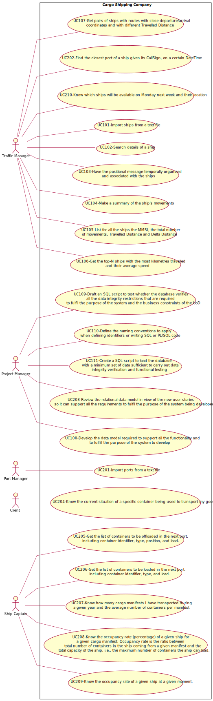
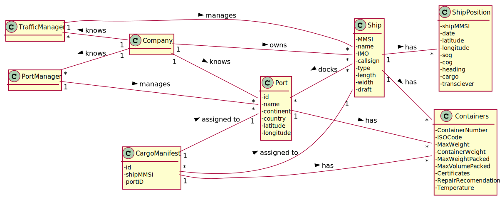
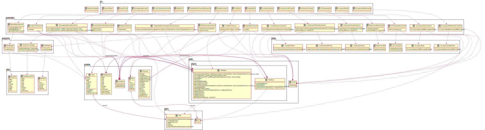
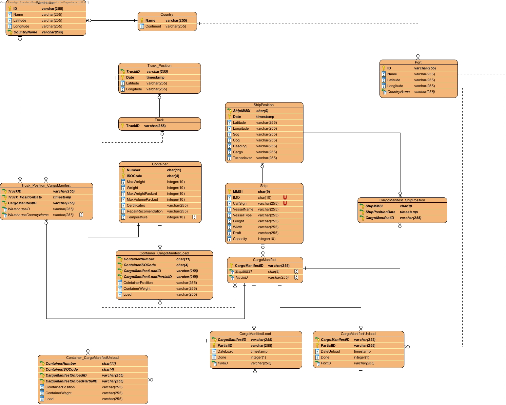

### **Group 45**
* Bruno Ribeiro nº1201000
* Carlos Rodrigues nº1201001
* José Pessoa nº1201007
* Rita Lello nº1201240

## Document Division
This document is divided in different categories, such as:

1. Software Engineering

      1. Use Case Diagram
   
      2. Engineering Analysis:
      
         1. Domain Model (DM) for the whole project
   
      3. Engineering Design:
      
         1. Class Diagram (CD) for the whole project
      
         2. Relational Model (Normalised) for the whole project

      4. US201
   
      5. US202

      6. US204
   
      7. US205
   
      8. US206
   
      9. US207
   
      10. US208
   
      11. US209
   
      12. US210
   
   
2. Report
   
      1. Problem Statement
         
      2. Project Division Organization
      
      3. Project Coverage
      
      4. Pit Test Coverage Report
      
      5. Team Performance
   
# Software Engineering

## Use Case Diagram

## Engineering Analysis

### Domain Model

## Engineering Design

### Class Diagram

### Relational Model Normalised

## [US201 markdown](docs/Sprint2/US201/US201.md)
## [US202 markdown](docs/Sprint2/US202/US202.md)
## [US204 markdown](docs/Sprint2/US204/US204.md)
## [US205 markdown](docs/Sprint2/US205/US205.md)
## [US206 markdown](docs/Sprint2/US206/US206.md)
## [US207 markdown](docs/Sprint2/US207/US207.md)
## [US208 markdown](docs/Sprint2/US208/US208.md)
## [US209 markdown](docs/Sprint2/US209/US209.md)
## [US210 markdown](docs/Sprint2/US210/US210.md)

# Report

## Problem Statement

A Cargo shipping company requires a software system to handle their logistics. This company
operates through land and sea, across different continents and has several warehouses spread along the world.

## Project Division Organization

| US201 | US202 | US203  | US204  | US205 | US206 |US207 | US208 | US209  | US210  |
|:-------------:|:---------------------:|:------------:|:----------------------------:|:-----------:|:------------:|:------------:|:------------:|:------------:|:------------|
| 1201001 1201007 |    1201240 | 1201000 1201007 | 1201007 | 1201000 | 1201000 | 1201001 | 1201001 1201240 | 1201001 1201240 | 1201001 |

## Project Coverage

## Pit Test Coverage Report

## Team Performance

In the first week of sprint , we were a bit slow because we didn't have the necessary knowledge to carry out the tasks so we took the opportunity to analyze the Us and organize ourselves

In the second week , We took a deeper look at some Us and were implementing the Us that we had analyzed earlier.

In the third week as we had the project analyzed, we just had to implement the remaining user stories.

Overall, it can be said that all elements of the group worked to reach our goal.
