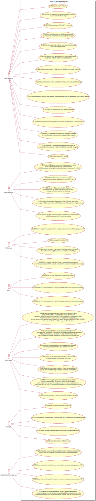
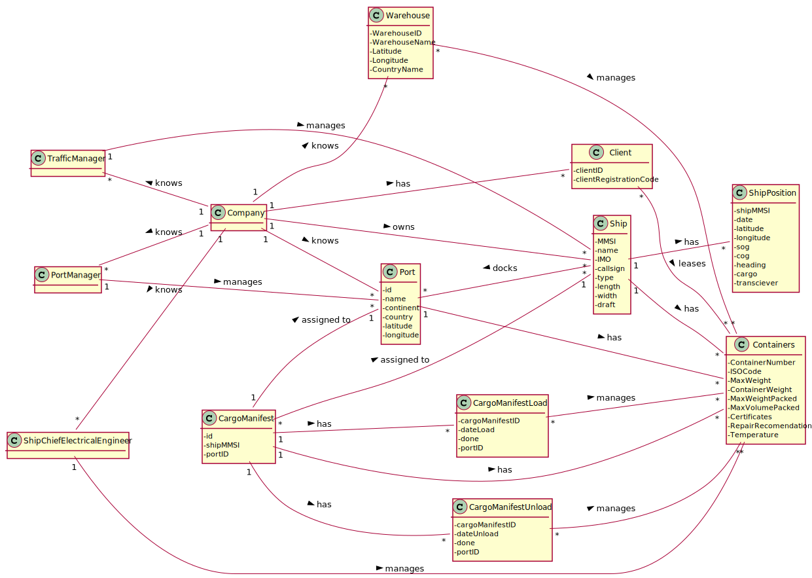
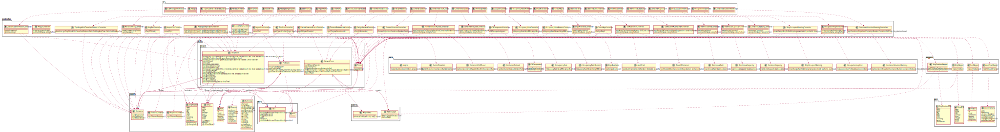
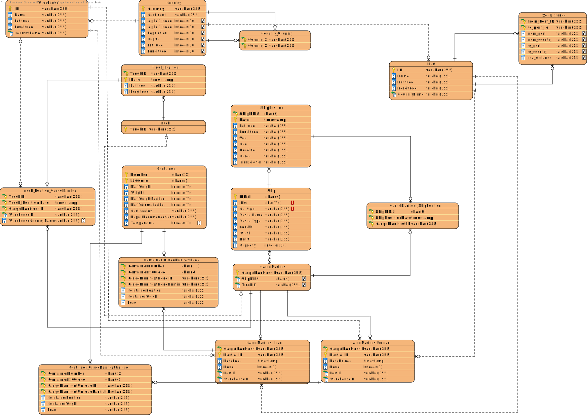

### **Group 45**
* Bruno Ribeiro nº1201000
* Carlos Rodrigues nº1201001
* José Pessoa nº1201007
* Rita Lello nº1201240

## Document Division
This document is divided in different categories, such as:

1. Software Engineering

      1. Use Case Diagram
   
      2. Engineering Analysis:
      
         1. Domain Model (DM) for the whole project
   
      3. Engineering Design:
      
         1. Class Diagram (CD) for the whole project
      
         2. Relational Model (Normalised) for the whole project

      4. US301
   
      5. US302

      6. US303
   
      7. US304
   
      8. US305
   
      9. US306
   
      10. US307
   
      11. US308
   
      12. US309
   
      13. US310
   
      14. US312

      15. US313
   
      16. US314
   
      17. US315
   
      18. US316
   
      19. US317
   
      20. US318
   
      21. US319
   
      22. US320
   
   
2. Report
   
      1. Problem Statement
         
      2. Project Division Organization
      
      3. Project Coverage
      
      4. Pit Test Coverage Report
      
      5. Team Performance
   
# Software Engineering

## Use Case Diagram

## Engineering Analysis

### Domain Model

## Engineering Design

### Class Diagram

### Relational Model Normalised

## [US301 markdown](docs/Sprint 3/US301/US301.md)
## [US302 markdown](docs/Sprint 3/US302/US302.md)
## [US303 markdown](docs/Sprint 3/US303/US303.md)
## [US304 markdown](docs/Sprint 3/US304/US304.md)
## [US305 markdown](docs/Sprint 3/US305/US305.md)
## [US306 markdown](docs/Sprint 3/US306/US306.md)
## [US307 markdown](docs/Sprint 3/US307/US307.md)
## [US308 markdown](docs/Sprint 3/US308/US308.md)
## [US309 markdown](docs/Sprint 3/US309/US309.md)
## [US310 markdown](docs/Sprint 3/US310/US310.md)
## [US312 markdown](docs/Sprint 3/US312/US312.md)
## [US313 markdown](docs/Sprint 3/US313/US313.md)
## [US314 markdown](docs/Sprint 3/US314/US314.md)
## [US315 markdown](docs/Sprint 3/US315/US315.md)
## [US316 markdown](docs/Sprint 3/US316/US316.md)
## [US317 markdown](docs/Sprint 3/US317/US317.md)
## [US318 markdown](docs/Sprint 3/US318/US318.md)
## [US319 markdown](docs/Sprint 3/US319/US319.md)
## [US320 summary](docs/Sprint 3/US320/Summary.pdf)

# Report

## Problem Statement

A Cargo shipping company requires a software system to handle their logistics. This company
operates through land and sea, across different continents and has several warehouses spread along the world.

## Project Division Organization

| US301 | US302 | US303  | US304  | US305 | US306 |US307 | US308 | US309  | US310  | US312 | US313  | US314  | US315 | US316 |US317 | US318 | US319  | US320  |
|:-------------:|:---------------------:|:------------:|:----------------------------:|:-----------:|:------------:|:------------:|:------------:|:------------:|:------------|:-------------:|:---------------------:|:------------:|:-----------:|:------------:|:------------:|:------------:|:------------:|:------------|
| 1201007 1201000 | 1201001 | 1201240 | 1201240 | 1201000 | 1201007 | 1201007 | 1201001 | 1201000 | 1201001 |1201240 | 1201001 1201007 | 1201000 | 1201007 | 1201240 | 1201000 1201240 | 1201001 1201007 | 1201000 1201001 1201007 1201240 | 1201000 1201001 1201007 1201240 |

## Project Coverage

## Pit Test Coverage Report

## Team Performance

In the first week of sprint , we were a bit slow because we didn't have the necessary knowledge to carry out the tasks so we took the opportunity to analyze the Us and organize ourselves

In the second week , We took a deeper look at some Us and were implementing the Us that we had analyzed earlier.

In the third week we implemented some user stories.

In the last week of the sprint as we had the project analyzed, we just had to implement the remaining user stories.

Overall, it can be said that all elements of the group worked to reach our goal.
