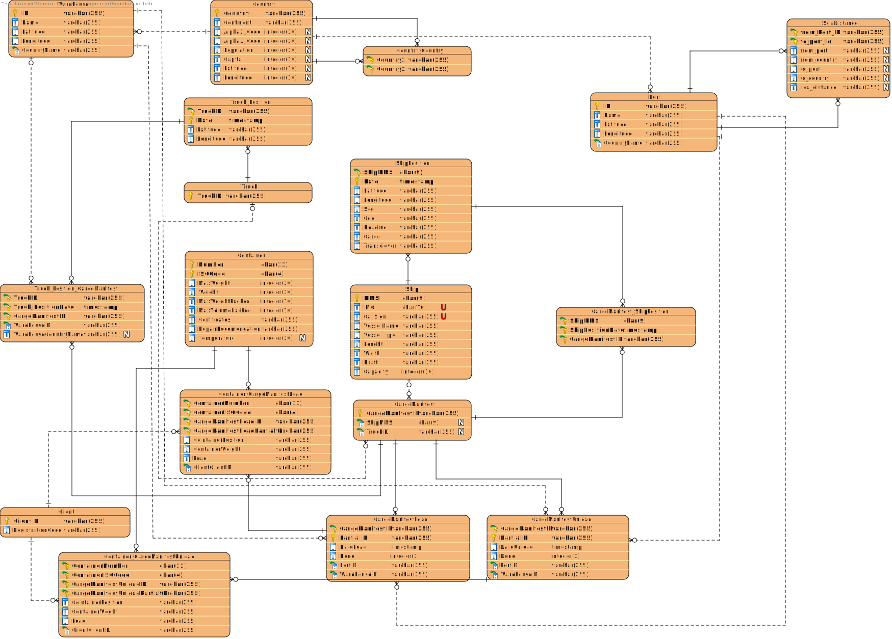

### **Group 45**
* Bruno Ribeiro nº1201000
* Carlos Rodrigues nº1201001
* José Pessoa nº1201007
* Rita Lello nº1201240

## Document Division
This document is divided in different categories, such as:

1. Software Engineering

      1. Use Case Diagram
   
      2. Engineering Analysis:
      
         1. Domain Model (DM) for the whole project
   
      3. Engineering Design:
      
         1. Class Diagram (CD) for the whole project
      
         2. Relational Model (Normalised) for the whole project

      4. US401
   
      5. US402

      6. US403
   
      7. US404
   
      8. US405
   
      9. US406
   
      10. US407
   
      11. US409
   
      12. US410
   
      13. US411
   
      14. US412

      15. US413
   
      16. US414
   
      17. US415
   
      18. US416
   
      19. US417
   
      20. US418
   
      21. US419
   
      22. US420
   
   
2. Report
   
      1. Problem Statement
         
      2. Project Division Organization
      
      3. Project Coverage
      
      4. Pit Test Coverage Report
      
      5. Team Performance
   
# Software Engineering

## Use Case Diagram

## Engineering Analysis

### Domain Model

## Engineering Design

### Class Diagram

### Relational Model Normalised

## [US401 markdown](docs/Sprint 4/US401/US401.md)
## [US402 markdown](docs/Sprint 4/US402/US402.md)
## [US403 markdown](docs/Sprint 4/US403/US403.md)
## [US404 markdown](docs/Sprint 4/US404/US404.md)
## [US405 markdown](docs/Sprint 4/US405/US405.md)
## [US406 markdown](docs/Sprint 4/US406/US406.md)
## [US407 markdown](docs/Sprint 4/US407/US407.md)
## [US409 markdown](docs/Sprint 4/US409/US409.md)
## [US410 markdown](docs/Sprint 4/US410/US410.md)
## [US411 markdown](docs/Sprint 4/US411/US411.md)
## [US412 markdown](docs/Sprint 4/US412/US412.md)
## [US413 markdown](docs/Sprint 4/US413/US413.md)
## [US414 markdown](docs/Sprint 4/US414/US414.md)
## [US415 markdown](docs/Sprint 4/US415/US415.md)
## [US416 summary](docs/Sprint 4/US416/Summary.pdf)
## [US417 markdown](docs/Sprint 4/US417/US417.md)
## [US418 markdown](docs/Sprint 4/US418/US418.md)
## [US419 markdown](docs/Sprint 4/US419/US419.md)
## [US420 markdown](docs/Sprint 4/US420/US420.md)

# Report

## Problem Statement

A Cargo shipping company requires a software system to handle their logistics. This company
operates through land and sea, across different continents and has several warehouses spread along the world.

## Project Division Organization

| US401 | US402 | US403  | US404  | US405 | US406 | US407 | US409 | US410  | US411  | US412 | US413  | US414  | US415 | US416 |US417 | US418 | US419  | US420  |
|:-------------:|:---------------------:|:------------:|:----------------------------:|:-----------:|:------------:|:------------:|:------------:|:------------:|:------------|:-------------:|:---------------------:|:------------:|:-----------:|:------------:|:------------:|:------------:|:------------:|:------------|
| 1201000 | 1201001 1201007 | 1201240 | 1201001 | 1201000 | 1201240 | 1201007 | 1201001 1201007 | 1201000 | 1201240 | 1201001 | 1201000 | 1201007 | 1201240 | 1201000 1201001 1201007 1201240 | 1201000 | 1201001 | 1201007 | 1201240 |

## Project Coverage

## Pit Test Coverage Report

## Team Performance

In the first week of sprint , we were a bit slow, but we took the opportunity to analyze the Us and organize ourselves.

In the second week , We took a deeper look at some Us and were implementing the Us that we had analyzed earlier.8

In the last week of the sprint as we had the project analyzed, we just had to implement the remaining user stories.

Overall, it can be said that all elements of the group worked to reach our goal.
