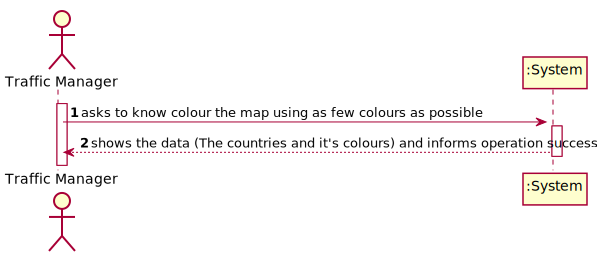
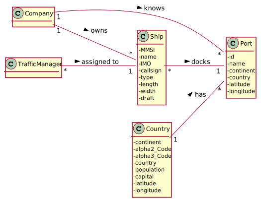
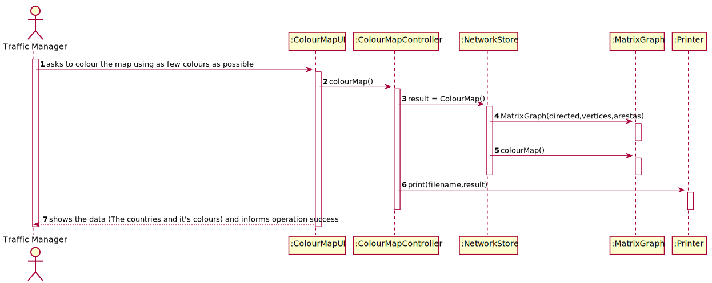
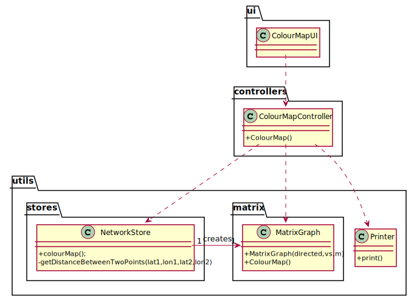

# US 302 - As Traffic manager, I need to colour the map using as few colours as possible

## 1. Requirements Engineering

### 1.1. User Story Description

As Traffic manager, I need to colour the map using as few colours as possible

### 1.2. Customer Specifications and Clarifications

From the client clarifications:

### 1.3. Acceptance Criteria

* AC1:"Neighbouring countries must not share the same colour."

### 1.4. Found out Dependencies

### 1.5 Input and Output Data

Output Data

* The countries and it's colours
* (In)Success of the operation

### 1.6. System Sequence Diagram (SSD)

### 1.7 Other Relevant Remarks

## 2. OO Analysis

### 2.1. Relevant Domain Model Excerpt

### 2.2. Other Remarks

## 3. Design - User Story Realization

### 3.1. Sequence Diagram (SD)

## 3.2. Class Diagram (CD)

# 4. Tests

**Test 1:**

		@Test
        void colourMap() throws SQLException, IOException {
        ColourMapController colourMapController = new ColourMapController();
        boolean result=colourMapController.colourMap();
        assertTrue(result);
        }