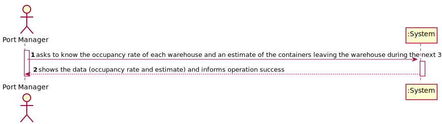
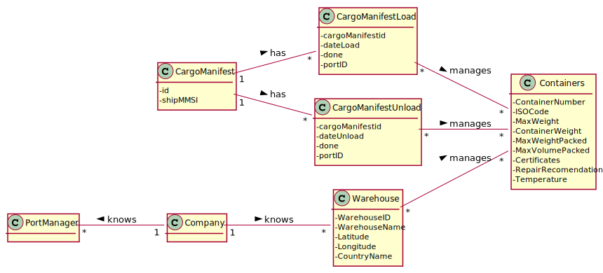
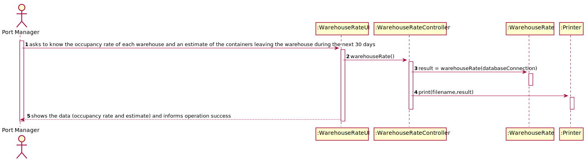
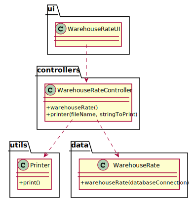

# US 306 - As Port manager, I want to know the occupancy rate of each warehouse and an estimate of the containers leaving the warehouse during the next 30 days.

## 1. Requirements Engineering

### 1.1. User Story Description

As Port manager, I want to know the occupancy rate of each warehouse and an estimate of the containers leaving the warehouse during the next 30 days.

### 1.2. Customer Specifications and Clarifications

From the client clarifications:

### 1.3. Acceptance Criteria

* AC1:"For each warehouse the required output is available."
* AC2:"The 30 days period is properly considered."

### 1.4. Found out Dependencies

### 1.5 Input and Output Data

Input Data

* Typed data:

Output Data

* occupancy rate and estimate
* (In)Success of the operation

### 1.6. System Sequence Diagram (SSD)

### 1.7 Other Relevant Remarks

## 2. OO Analysis

### 2.1. Relevant Domain Model Excerpt

### 2.2. Other Remarks

## 3. Design - User Story Realization

### 3.1. Sequence Diagram (SD)

## 3.2. Class Diagram (CD)

# 4. Tests

**Test 1:** 

		@Test
		void warehouseRate() throws SQLException, IOException {
        WarehouseRateController c = new WarehouseRateController();
        Assertions.assertTrue(c.warehouseRate());
        Assertions.assertNotEquals(false, c.warehouseRate());
    	}

