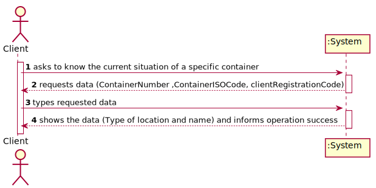
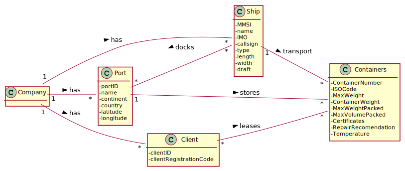
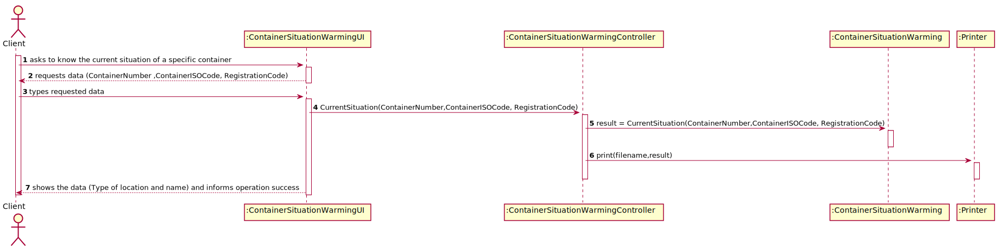

# US 312 - As Client, I want to know the current situation of a specific container being used to transport my goods.

## 1. Requirements Engineering

### 1.1. User Story Description

As Client, I want to know the current situation of a specific container being used to transport my goods.

### 1.2. Customer Specifications and Clarifications

From the client clarifications:

### 1.3. Acceptance Criteria

* AC1:"When the provided identifier is not valid or, being valid, is not leased by the client, a warning is returned. This warning has two elements, the error code and the identifier of the container. The error code will be: 10 – invalid container id or 11 – container is not leased by client."

### 1.4. Found out Dependencies

* There is a dependency to "US204 - As Client, I want to know the current situation of a specific container being used to transport my goods." since this new one will use the same as US204, adding a warning when something goes wrong.

### 1.5 Input and Output Data

Input Data

* Typed data:
  	
	* containerNumber
	* containerISOCode
	* registrationCode

Output Data

* type of location and name
* (In)Success of the operation

### 1.6. System Sequence Diagram (SSD)

### 1.7 Other Relevant Remarks

## 2. OO Analysis

### 2.1. Relevant Domain Model Excerpt

### 2.2. Other Remarks

## 3. Design - User Story Realization

### 3.1. Sequence Diagram (SD)

## 3.2. Class Diagram (CD)

# 4. Tests

**Test 1:** 

		@Test
		void getContainerSituation() throws SQLException, IOException {
        ContainerSituationWarmingController c = new ContainerSituationWarmingController();
        Assert.assertTrue(c.getContainerSituation("78546321458", "4785", "12345"));
        Assert.assertFalse(c.getContainerSituation("78546321458", "4285", "14345"));
        Assert.assertNotEquals(true, c.getContainerSituation("78546321458", "4285", "14345"));
        Assert.assertNotEquals(false, c.getContainerSituation("78546321458", "4785", "12345"));
    	}

