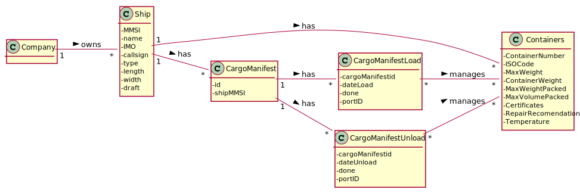

# US 316 - As a Port staff, given a set of positions, I wish to know the total number of occupied slots.

## 1. Requirements Engineering

### 1.1. User Story Description

As a Port staff, given a set of positions, I wish to know the total number of occupied slots.

### 1.2. Customer Specifications and Clarifications

From the client clarifications:

* Question: "Pelo que percebi, nesta US vamos receber uma lista de posições, e depois com cada posição recebida, verificamos na matriz de 3 dimensões se essa slot está ocupada com um contentor ou não. A minha questão é: como é que vai ser o input da lista de posições? Pelo que o professor respondeu será um vetor de 3 dimensões mas penso que isso é a nossa matriz dos contentores e não a lista de posições para serem verificadas.
Podemos fazer um vetor de 2 dimensões com 3 colunas , em que cada coluna representa o x, y e z da posição e as linhas são as várias posições? "
  * [Answer:](https://moodle.isep.ipp.pt/mod/forum/discuss.php?d=12910) "Se isto vos está a causar confusão, podem optar pela solução que mais vos facilita a obtenção das posições dos contentores. Pode, por exemplo, ser um vetor unidimensional em que cada três elementos se referem às coordenadas x,y,z de um mesmo contentor: [x1,y1,z1,x2,y2,z2,...,xn,yn,zn]
O importante nesta US é avaliar os vossos conhecimentos de invocação de uma função auxiliar para cada um dos contentores presentes nessa lista."

### 1.3. Acceptance Criteria

* AC1:"Using the Assembly function developed in the previous US, develop
  another Assembly function that traverses an array of positions and
  determines the total number of occupied slots."

### 1.4. Found out Dependencies

### 1.5 Input and Output Data

Input Data

* Typed data:

Output Data

*  The total number of occupied slots from the set of positions
* (In)Success of the operation

### 1.6. System Sequence Diagram (SSD)

### 1.7 Other Relevant Remarks

## 2. OO Analysis

### 2.1. Relevant Domain Model Excerpt

### 2.2. Other Remarks

## 3. Design - User Story Realization

### 3.1. Sequence Diagram (SD)

## 3.2. Class Diagram (CD)

# 4. Tests

