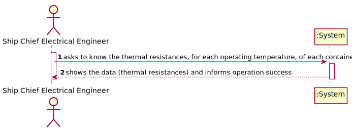
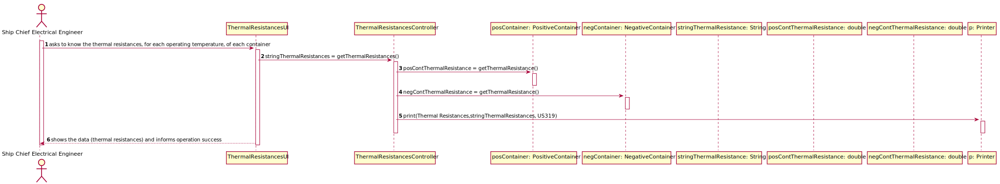
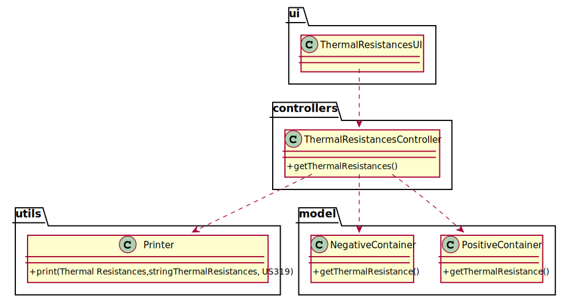

# US 319 - As Ship Chief Electrical Engineer I want to know the thermal resistance, for each operating temperature, of each container that must contain at least three different materials in its walls.

## 1. Requirements Engineering

### 1.1. User Story Description

As Ship Chief Electrical Engineer I want to know the thermal resistance, for each operating temperature, of each container that must contain at least three different materials in its walls.

### 1.2. Customer Specifications and Clarifications

From the client clarifications:

### 1.3. Acceptance Criteria

* AC1:"For each container, working at a temperature of 7ºC, determine the thermal resistance it offers, according to the choice of materials made."
* AC2:"For each container working at a temperature of -5ºC, determine the thermal resistance it offers according to the choice of materials."

### 1.4. Found out Dependencies

* There is a dependency to "US317 - As Ship Chief Electrical Engineer I want to know what set of materials to use in a container, to operate at temperatures of 7°C." and "US318 - As Ship Chief Electrical Engineer I want to know what set of materials to use in a container, to operate at temperatures of -5 °C." since the materials of the containers are defined in these User Stories.

### 1.5 Input and Output Data

Input Data

Output Data

* Thermal resistances
* (In)Success of the operation

### 1.6. System Sequence Diagram (SSD)

### 1.7 Other Relevant Remarks

## 2. OO Analysis

### 2.1. Relevant Domain Model Excerpt

### 2.2. Other Remarks

## 3. Design - User Story Realization

### 3.1. Sequence Diagram (SD)

## 3.2. Class Diagram (CD)

# 4. Tests

**Test 1:** 

		@Test
		

