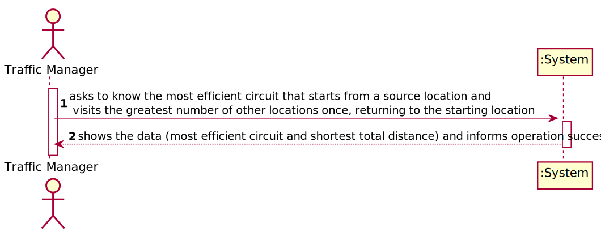
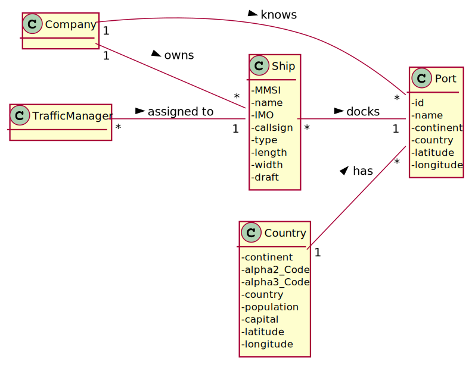
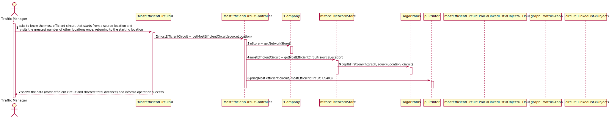
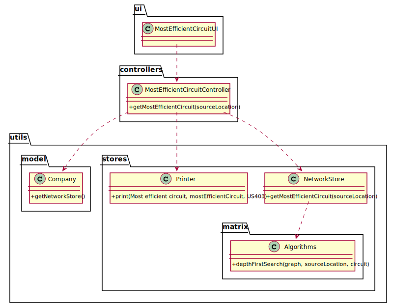

# US 403 - As a Traffic manager I wish to know the most efficient circuit that starts from a source location and visits the greatest number of other locations once, returning to the starting location and with the shortest total distance.

## 1. Requirements Engineering

### 1.1. User Story Description

As a Traffic manager I wish to know the most efficient circuit that starts from a source location and visits the greatest number of other locations once, returning to the starting location and with the shortest total distance.

### 1.2. Customer Specifications and Clarifications

From the client clarifications:

* Question: "Os critérios de avaliação dos circuitos são primeiro pelo número de vértices e depois pelo tamanho do caminho ou a ideia da US é criar um algoritmo que possa decidir qual o melhor?"
	* [Answer:](https://moodle.isep.ipp.pt/mod/forum/discuss.php?d=13738) "No circuito fechado deve primeiro dar preferência ao maior número de locais e depois à menor distância."

### 1.3. Acceptance Criteria

* AC1:"Implement one of the heuristics used for this type of circuit."

### 1.4. Found out Dependencies

* There is a dependency to "US301 - As a Traffic manager, I which to import data from countries, ports, borders and seadists files from the database to build a freight network." since the graph must exist to show the most efficient circuit.

### 1.5 Input and Output Data

Input Data

* Typed data:
  	
	* source location

Output Data

* most efficient circuit
* shortest total distance
* (In)Success of the operation

### 1.6. System Sequence Diagram (SSD)

### 1.7 Other Relevant Remarks

## 2. OO Analysis

### 2.1. Relevant Domain Model Excerpt

### 2.2. Other Remarks

## 3. Design - User Story Realization

### 3.1. Sequence Diagram (SD)

## 3.2. Class Diagram (CD)

# 4. Tests

**Test 1:** 

	@Test
	void getMostEfficientCircuit() throws IOException, SQLException {
	MostEfficientCircuitController mostEfficientCircuitController = new MostEfficientCircuitController();
	Pair<LinkedList<Object>, Double> result = mostEfficientCircuitController.getMostEfficientCircuit("18012");
	String expected = "Circuit: [18012, 18137, 18682, 18326, 29002, 29239, 224858, 29749, 10358, 10563, 23247, 20512, 14277, 26147, 21451, 17941, 14635, 10860, 30045, 13390, 216592, 216593, 18476, 18433, 213737, 21863, 10136, 21852, 22522, 246265, 18200, 11174, 13176, 24795, 14470, 18937, 17386, 22770, 12543, 21381, 11771, 18454, 20072, 25350, 16737, 18867, 16485, 28313, 24951, 22226, 27792, 28082, 21556, 21457, 21206, 25007, 27728, 23428, 13012, 14459, 14113, 26670, 27248, 20301, 20351, 20847, 28781, 15107, 14226, 29876, 28261, 20826, 29973, 18012] with distance=199686.0km";
	Assertions.assertEquals(expected, result.toString2());
	}

