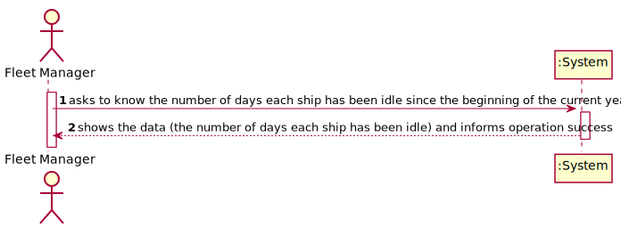
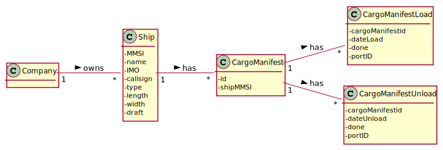
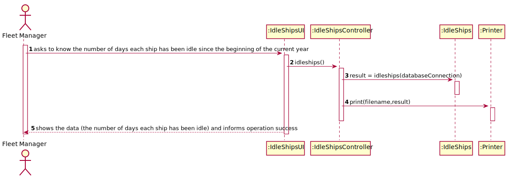
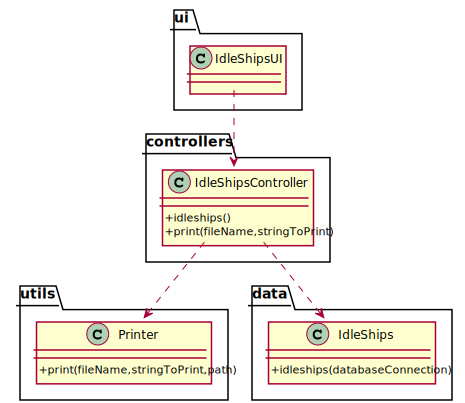

# US 404 - As a Fleet Manager I wish to know the number of days each ship has been idle since the beginning of the current year.

## 1. Requirements Engineering

### 1.1. User Story Description

As a Fleet manager I wish to know the number of days each ship has been idle since the beginning of the current year.

### 1.2. Customer Specifications and Clarifications

From the client clarifications:

* Question: "In US404 says " As Fleet Manager, I want to know the number of days each ship has been idle since the beginning of the current year ", so my question is, should we consider the time a ship is docked in a port until the departure of that port ?"
	* [Answer:](https://moodle.isep.ipp.pt/mod/forum/discuss.php?d=13396) "Yes."
	
### 1.3. Acceptance Criteria

* AC1:"Current year is properly identified."
* AC2:"Idle time is correctly computed per ship."
* AC3:"Ships with no idle time are also reported."

### 1.4. Found out Dependencies

### 1.5 Input and Output Data

Input Data

Output Data

* number of days each ship has been idle since
* (In)Success of the operation

### 1.6. System Sequence Diagram (SSD)

### 1.7 Other Relevant Remarks

## 2. OO Analysis

### 2.1. Relevant Domain Model Excerpt

### 2.2. Other Remarks

## 3. Design - User Story Realization

### 3.1. Sequence Diagram (SD)

## 3.2. Class Diagram (CD)

# 4. Tests

