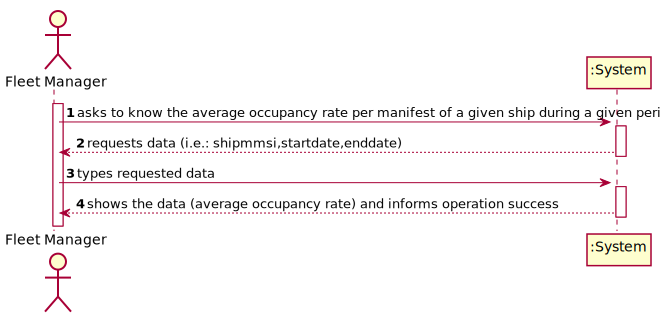
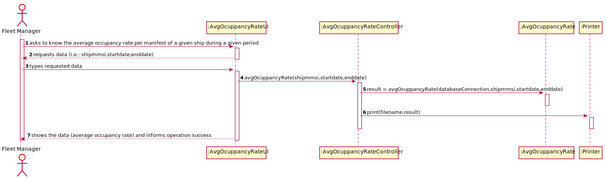
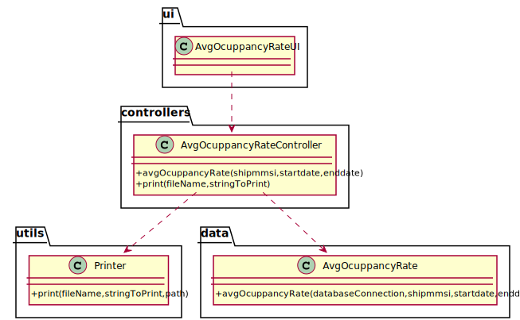

# US 405 - As Fleet Manager, I want to know the average occupancy rate per manifest of a given ship during a given period.

## 1. Requirements Engineering

### 1.1. User Story Description

As Fleet Manager, I want to know the average occupancy rate per manifest of a given ship during a given period.

### 1.2. Customer Specifications and Clarifications

From the client clarifications:

* Question: "Dear client, the description of this US is. "As Fleet Manager, I want to know the average occupancy rate per manifest of a given ship during a given period". My question is: is it supposed to get the average occupancy rate of the unloading or loading manifests?"
	* [Answer:](https://moodle.isep.ipp.pt/mod/forum/discuss.php?d=13713) "The average occupancy rate, from this point of view, is related to loading manifests, those that require a share of the ship's capacity;"

* Question: "Dear client, In this segment of the assignment of US405 that says "the average occupancy rate per manifest of a given ship during a given period", does this average equate to the average occupancy rate of a ship during all of its trips between two ports? And if so, what does "ship voyages" in US406 mean? Is it, for example, the combination of all the trips a ship made between two ports (trip 1: port A to port B, trip 2: port B to port C, voyage: port A to port C)?"
	* [Answer:](https://moodle.isep.ipp.pt/mod/forum/discuss.php?d=13697) "The request does not relate to ports but to time! I want to know, for instance, the average percentage of occupied slots in ship A during the last six months of 2021. The concept of "ship voyage" is explained in the US description: a ship voyage is a trip by a ship that has a "place and date of origin and destination""
	

### 1.3. Acceptance Criteria

* AC1:"Ship is properly identified and considered."
* AC2:"Period is properly identified and considered."
* AC3:"Average occupancy rate per manifest and ship is correctly computed."

### 1.4. Found out Dependencies

### 1.5 Input and Output Data

Input Data

* Typed data:
  	
	* mmsi
	* start date
	* end date

Output Data

* average occupancy rate
* (In)Success of the operation

### 1.6. System Sequence Diagram (SSD)

### 1.7 Other Relevant Remarks

## 2. OO Analysis

### 2.1. Relevant Domain Model Excerpt

### 2.2. Other Remarks

## 3. Design - User Story Realization

### 3.1. Sequence Diagram (SD)

## 3.2. Class Diagram (CD)

# 4. Tests

**Test 1:** 

	@Test
    void avgOcuppancyRate() throws SQLException, IOException {
        AvgOcuppancyRateController avgOcuppancyRateController = new AvgOcuppancyRateController();
        boolean result=avgOcuppancyRateController.avgOcuppancyRate("789789789","2021-03-18 00:16:01","2021-03-28 00:16:01");
        assertTrue(result);
    }

