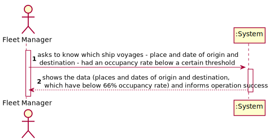
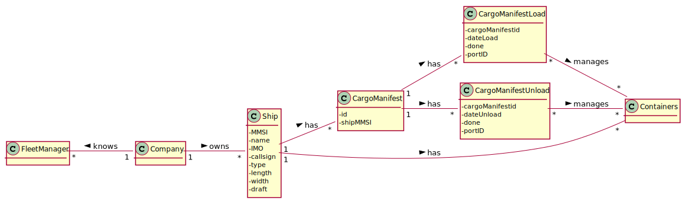
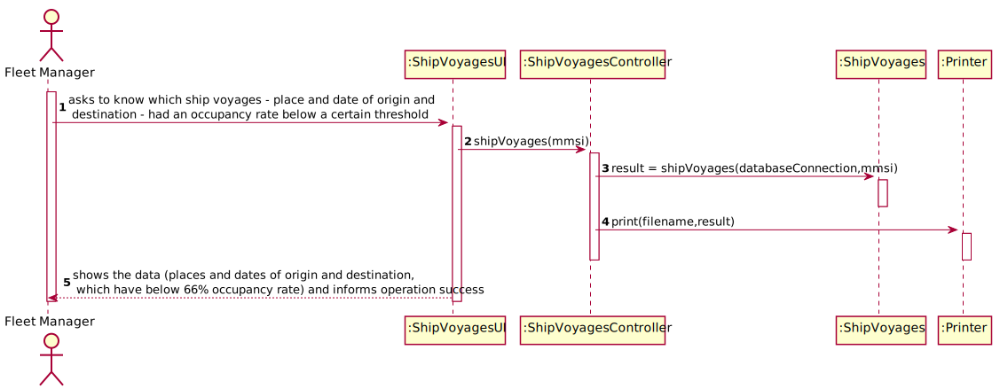
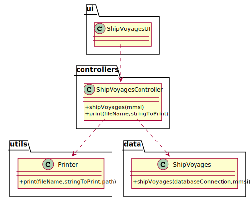

# US 406 - As Fleet Manager, I want to know which ship voyages – place and date of origin and destination – had an occupancy rate below a certain threshold; by default, consider an occupancy rate threshold of 66%. Only the trips already concluded are to be considered.

## 1. Requirements Engineering

### 1.1. User Story Description

As Fleet Manager, I want to know which ship voyages – place and date of origin and destination – had an occupancy rate below a certain threshold; by default, consider an occupancy rate threshold of 66%. Only the trips already concluded are to be considered.

### 1.2. Customer Specifications and Clarifications

From the client clarifications:

* Question: "In US406 is asked to reuse US405. In US405 is required a period of time in which we calculate the average occupancy rate per cargo manifest from a given ship. With that in mind, how are we supposed to use the US405 in US406 even though we dont have a period of time in order to get the occupancy rate of a given trip can I use US208 instead of US405 or what period of time should I use in US405?"
	* [Answer:](https://moodle.isep.ipp.pt/mod/forum/discuss.php?d=13733) "For US405 "I want to know the average occupancy rate per manifest of a given ship during a given period" the "given" values are expected to be arguments to the function that computes average occupancy."

* Question: "In this segment of the assignment of US405 that says "the average occupancy rate per manifest of a given ship during a given period", does this average equate to the average occupancy rate of a ship during all of its trips between two ports? And if so, what does "ship voyages" in US406 mean? Is it, for example, the combination of all the trips a ship made between two ports (trip 1: port A to port B, trip 2: port B to port C, voyage: port A to port C)?"
	* [Answer:](https://moodle.isep.ipp.pt/mod/forum/discuss.php?d=13697) "The request does not relate to ports but to time! I want to know, for instance, the average percentage of occupied slots in ship A during the last six months of 2021. The concept of "ship voyage" is explained in the US description: a ship voyage is a trip by a ship that has a "place and date of origin and destination""

### 1.3. Acceptance Criteria

* AC1:"Reuses US405."
* AC2:"Average occupancy rate is properly computed."
* AC3:"Trips still ongoing are not considered for the occupancy rate calculations."

### 1.4. Found out Dependencies

* There is a dependency to "US405 - As Fleet Manager, I want to know the average occupancy rate per manifest of a given ship during a given period." since like requested in AC1.

### 1.5 Input and Output Data

Input Data

* Typed data:
  	
	* ship
	* period

Output Data

* average occupancy rate
* (In)Success of the operation

### 1.6. System Sequence Diagram (SSD)

### 1.7 Other Relevant Remarks

## 2. OO Analysis

### 2.1. Relevant Domain Model Excerpt

### 2.2. Other Remarks

## 3. Design - User Story Realization

### 3.1. Sequence Diagram (SD)

## 3.2. Class Diagram (CD)

# 4. Tests

**Test 1:** 

	@Test
    void shipVoyages() throws SQLException, IOException {
        ShipVoyagesController svc = new ShipVoyagesController();
        boolean result=svc.shipVoyages("789789789");
        assertTrue(result);
    }

