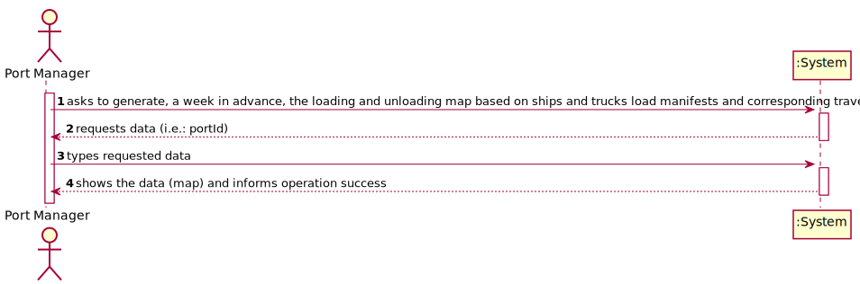
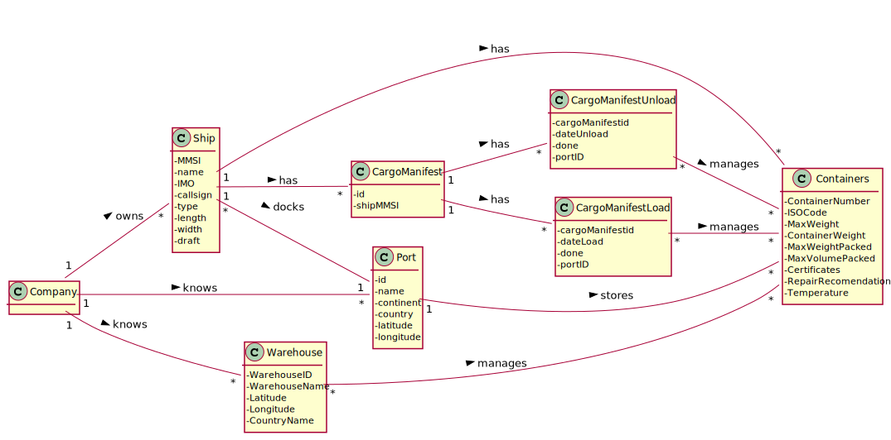
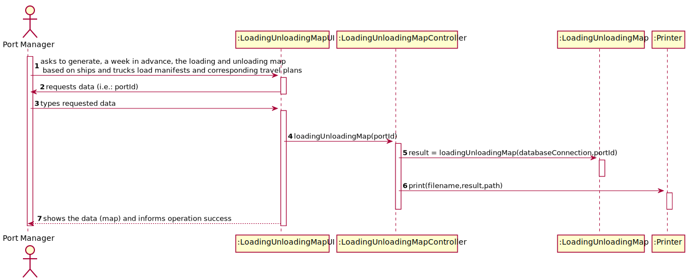
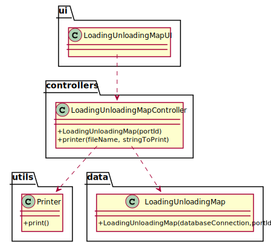

# US 407 - As Port manager, I intend to generate, a week in advance, the loading and unloading map based on ships and trucks load manifests and corresponding travel plans, to anticipate the level of sufficient and necessary resources (loading and unloading staff, warehouse staff, ...).

## 1. Requirements Engineering

### 1.1. User Story Description

As Port manager, I intend to generate, a week in advance, the loading and unloading map based on ships and trucks load manifests and corresponding travel plans, to anticipate the level of sufficient and necessary resources (loading and unloading staff, warehouse staff, ...).

### 1.2. Customer Specifications and Clarifications

From the client clarifications:

* Question: "Could you explain what are the resources needed in "Loading and unloading map is clear with respect to the sufficient and necessary resources for loading and unloading tasks.""
	* [Answer:](https://moodle.isep.ipp.pt/mod/forum/discuss.php?d=13441) "This is not a concern for this US. We just need to show the information about the expected loads/unloads that will, then, allow to perform staff and machinery resources' allocation."

* Question: "You have requested that the: "Loading and unloading map is clear with respect to the sufficient and necessary resources for loading and unloading tasks". Does this mean you wish for the necessary resources to be calculated and shown or that you wish to receive the loading and unloading information to do so? If the former, how should the necessary resources be computed?"
	* [Answer:](https://moodle.isep.ipp.pt/mod/forum/discuss.php?d=13627) "I wish to receive the loading and unloading information allowing me to do the resources allocation plan"

* Question: "In US 407 is asked to "generate (...) the loading and unloading map based on ships and trucks load manifests". Are we supposed to show the list of containers being loaded and unloaded at each port and warehouse?"
	* [Answer:](https://moodle.isep.ipp.pt/mod/forum/discuss.php?d=13651) "The loading/unloading map is a list , sorted by chronological order of all loads and unloads of ships and trucks at a given port that are planned for the coming week.The list should include the following elements: date of load/unload, ship/truck identifier, number of containers to load/unload and the details of each one, mainly the position on the ship"

* Question: " In US407 is asked to "anticipate the level of sufficient and necessary resources (loading and unloading staff, warehouse staff, ...)". How can we calculate the necessary resources? We know which warehouse/port the respective staff works in. Should just add up every worker at the warehouse and present to you the total amount of employees involved in next week's operations?"
	* [Answer:](https://moodle.isep.ipp.pt/mod/forum/discuss.php?d=13652) "The load/unload map will give the Port Manager a clear picture of the workload for next week. He will then be able to anticipate the needs for staff and machinery. We are not concerned with the details of these needs; we are only concerned to provide the information on the work that is foreseen for the next week"

* Question: "In US407 is asked to "generate, a week in advance, the loading and unloading map". Are we supposed to show this information only for every single day for a 7-day interval or should we just calculate on the 7th day?"
	* [Answer:](https://moodle.isep.ipp.pt/mod/forum/discuss.php?d=13653) "The load/unload map is needed one week in advance so it cannot be computed on the 7th day"
	

### 1.3. Acceptance Criteria

* AC1:"Week in advance is properly identified."
* AC2:"Loading and unloading map is comprehensive."
* AC3:"Loading and unloading map is clear with respect to the sufficient and necessary resources for loading and unloading tasks"

### 1.4. Found out Dependencies

### 1.5 Input and Output Data

Input Data

* Typed data:
  	
	* port id

Output Data

* load/unload map
* (In)Success of the operation

### 1.6. System Sequence Diagram (SSD)

### 1.7 Other Relevant Remarks

## 2. OO Analysis

### 2.1. Relevant Domain Model Excerpt

### 2.2. Other Remarks

## 3. Design - User Story Realization

### 3.1. Sequence Diagram (SD)

## 3.2. Class Diagram (CD)

# 4. Tests

**Test 1:** 

	@Test
    void loadingUnloading() throws SQLException, IOException {
        LoadingUnloadingMapController loadingUnloadingMapController = new LoadingUnloadingMapController();
        boolean result = loadingUnloadingMapController.loadingUnloading("42042");
        assertTrue(result);
    }

