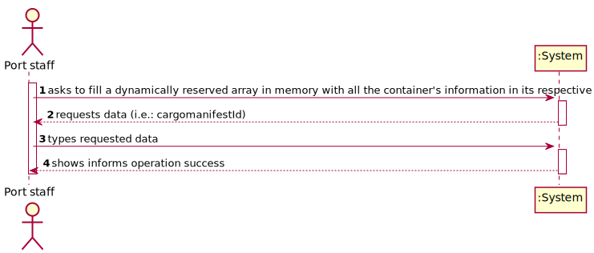
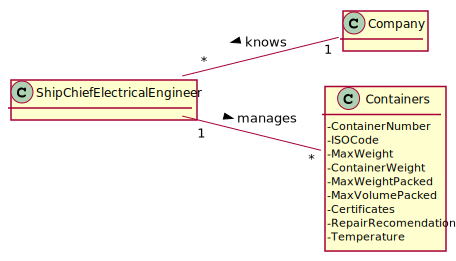
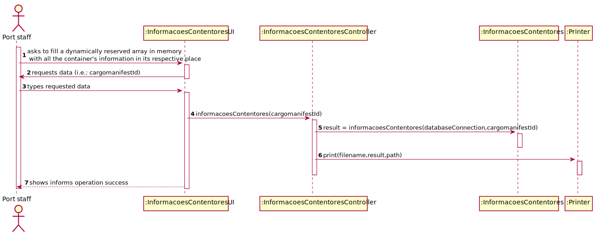
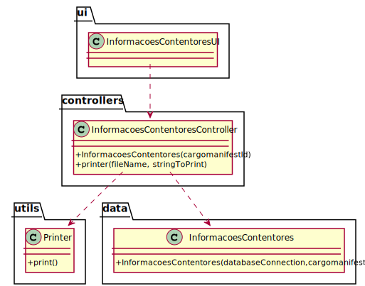

# US 409 - As a Port staff given a Cargo Manifest, I wish to fill a dynamically reserved array in memory with all the container's information in its respective place

## 1. Requirements Engineering

### 1.1. User Story Description

As a Port staff given a Cargo Manifest, I wish to fill a dynamically reserved  array in memory with all the container's information in its respective place

### 1.2. Customer Specifications and Clarifications

From the client clarifications:

* Question: "O array dinâmico a ser criado terá as estruturas seguidas na memória, sem memória livre entre estruturas (não considerando a memória livre necessária para cumprir os requisitos da estrutura), ou será como se fosse uma matriz de 3 dimensões segundo as coordenadas, podendo haver memória livre correspondente aos espaços vazios do navio? Caso seja o segundo caso, deveríamos "descartar" a matriz estática criada no Sprint 3 e, possivelmente, alterar as funções criadas nesse Sprint? Caso sejam alteradas, devemos usar parâmetros ou podemos continuar a usar as variáveis globais?"
	* [Answer:](https://moodle.isep.ipp.pt/mod/forum/discuss.php?d=13700) "é um array unidimensional de estruturas, por isso, de acordo com os termos que usaste, "sem memória livre" entre posições. O array tem de ser dinâmico, e devem ajustar o tamanho e posição dos campos para minimizar o consumo de memória. "
	
* Question: "Pelo que percebi nesta US é esperado que passemos de uma matriz 3D para um array de structs. A matriz 3D era construída tendo em conta as posições do container no ship, ou seja, matriz[x][y][z]. No entanto, neste caso como é um array que é pedido suponho que estas posições passem a ser guardadas dentro da struct. Será que me podia dizer se estou a pensar corretamente?"
	* [Answer:](https://moodle.isep.ipp.pt/mod/forum/discuss.php?d=13647) "Sim, as coordenadas x,y e z são campos da estrutura. Além destes campos, devem existir todos os outros necessários para caracterizar um contentor (se é ou não refrigerado, dimensões, materiais, espessuras, etc) e ser possível determinar os gastos energéticos."
	
### 1.3. Acceptance Criteria

* AC1:"The array should be dynamically reserved in C, adjusting the size of the array to the amount of handled data"
* AC2:"All the details of a container can be present in more than one file. As such, define a struct that represents a container. Therefore, in the end, you should have a matrix of structs."
* AC3:"The data types chosen for each field of the struct should be adjusted to the types of values they store. Memory usage should be kept to the minimum required. Also consider the order of fields that minimizes memory consumption."
* AC4:"The function should be developed in C."

### 1.4. Found out Dependencies

### 1.5 Input and Output Data

Input Data

* Cargo Manifest

Output Data

* (In)Success of the operation

### 1.6. System Sequence Diagram (SSD)

### 1.7 Other Relevant Remarks

## 2. OO Analysis

### 2.1. Relevant Domain Model Excerpt

### 2.2. Other Remarks

## 3. Design - User Story Realization

### 3.1. Sequence Diagram (SD)

## 3.2. Class Diagram (CD)

# 4. Tests

