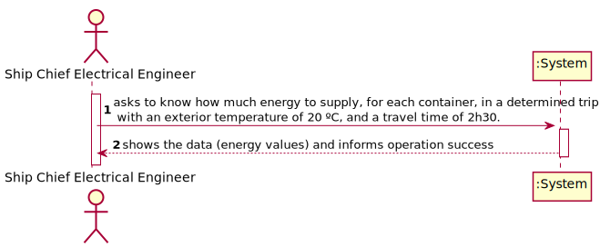
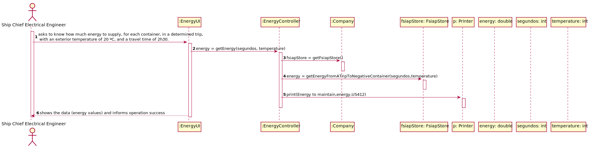
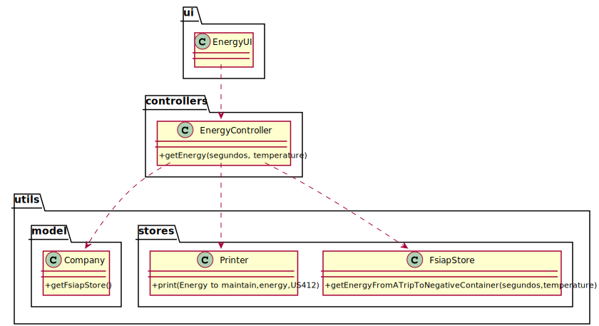

# US 412 - As Ship Chief Electrical Engineer, we intend to know how much energy to supply, for each container, in a determined trip, with an exterior temperature of 20 ºC, and a travel time of 2h30.

## 1. Requirements Engineering

### 1.1. User Story Description

As Ship Chief Electrical Engineer, we intend to know how much energy to supply, for each container, in a determined trip, with an exterior temperature of 20 ºC, and a travel time of 2h30.

### 1.2. Customer Specifications and Clarifications

From the client clarifications:

### 1.3. Acceptance Criteria

* AC1:"The total energy to be delivered to a container with an operating temperature of 7 °C"
* AC2:"The total energy to be delivered to a container with an operating temperature of - 5 °C."

### 1.4. Found out Dependencies

### 1.5 Input and Output Data

Input Data

* Typed Data:

	* time
	* temperature

Output Data

* energy needed to maintain the temperature of the containers
* (In)Success of the operation

### 1.6. System Sequence Diagram (SSD)

### 1.7 Other Relevant Remarks

## 2. OO Analysis

### 2.1. Relevant Domain Model Excerpt

### 2.2. Other Remarks

## 3. Design - User Story Realization

### 3.1. Sequence Diagram (SD)

## 3.2. Class Diagram (CD)

# 4. Tests

**Test 1:**
		
	@Test
    void getEnergy() throws IOException {
        EnergyController energyController=new EnergyController();
        String result = energyController.getEnergy(9000, 20);
        String expected = "The container that operates at temperatures of 7ºC in a trip of 2 hours and 30 minutes with an exterior temperature of 20 ºC" +
                " needs 1794253.27 J to maintain it's temperature\n" +
                "The container that operates at temperatures of -5ºC in a trip of 2 hours and 30 minutes with an exterior temperature of 20 ºC" +
                " needs 2262194.75 J to maintain it's temperature";
        Assertions.assertEquals(expected,result);
    }

		

