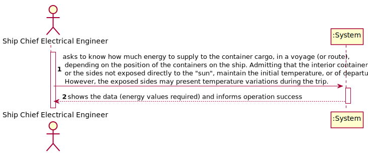
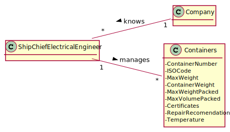
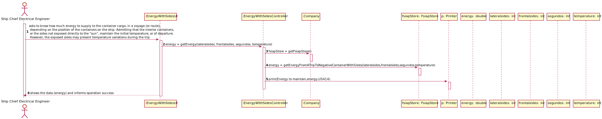
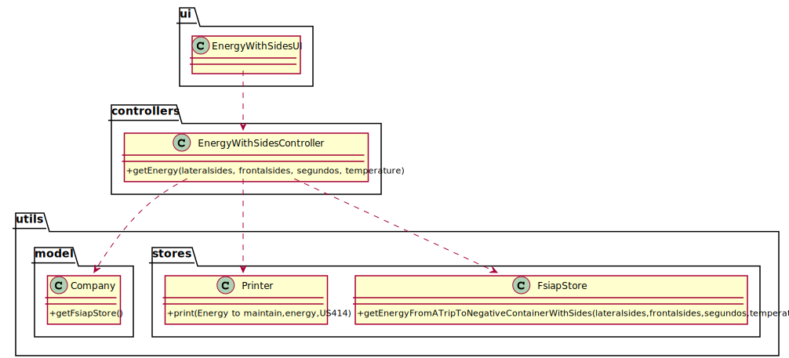

# US 414 - As Ship Chief Electrical Engineer, you want to know how much energy to supply to the container cargo, in a voyage (or route), depending on the position of the containers on the ship. Admitting that the interior containers, or the sides not exposed directly to the "sun", maintain the initial temperature, or of departure. However, the exposed sides may present temperature variations during the trip.

## 1. Requirements Engineering

### 1.1. User Story Description

As Ship Chief Electrical Engineer, you want to know how much energy to supply to the container cargo, in a voyage (or route), depending on the position of the containers on the ship. Admitting that the interior containers, or the sides not exposed directly to the "sun", maintain the initial temperature, or of departure. However, the exposed sides may present temperature variations during the trip.

### 1.2. Customer Specifications and Clarifications

From the client clarifications:

* Question: "Can we consider that for each side of the container exposed to the sun the temperature increments 1 degree?"
	* [Answer:](https://moodle.isep.ipp.pt/mod/forum/discuss.php?d=13659) "If you have the temperatures of the travel sections, the exposed faces should vary according to those temperatures."

* Question: "Should the US 414 be implemented?"
	* [Answer:](https://moodle.isep.ipp.pt/mod/forum/discuss.php?d=13492) "Yes, it must be implemented. Knowing the port of departure and port of arrival, they must know the distance and temperatures. Then consider that the faces of the exposed containers will be subject to thermal fluctuation. Unexposed faces (for simplicity) always maintain the starting temperature, for example."

### 1.3. Acceptance Criteria

* AC1:"Know the journey time."
* AC2:"Know the temperatures of the travel sections."
* AC3:"Know how many sides of each container are subject to temperature variation."
* AC4:"Determine the energy required for one trip of the containers at a temperature of 7 ºC, depending on their position in the load."
* AC5:"Determine the energy required for one trip of the containers at a temperature of -5 ºC, depending on their position in the cargo."

### 1.4. Found out Dependencies

### 1.5 Input and Output Data

Input Data

* Typed Data:

	* number of lateral sides of the containers
	* number of frontal sides of the containers
	* time
	* temperature

Output Data

* energy needed to maintain the temperature of the containers
* (In)Success of the operation

### 1.6. System Sequence Diagram (SSD)

### 1.7 Other Relevant Remarks

## 2. OO Analysis

### 2.1. Relevant Domain Model Excerpt

### 2.2. Other Remarks

## 3. Design - User Story Realization

### 3.1. Sequence Diagram (SD)

## 3.2. Class Diagram (CD)

# 4. Tests

**Test 1:**
		
	@Test
    void getEnergy() throws IOException {
        EnergyWithSidesController energyWithSidesController = new EnergyWithSidesController();
        String result = energyWithSidesController.getEnergy(6,6,3600,20);
        String expected = "The container that operates at temperatures of 7ºC in a trip of 1 hours and 0 minutes with an exterior temperature of 20 ºC" +
                " needs 1258214.51 J to maintain it's temperature\n" +
                "The container that operates at temperatures of -5ºC in a trip of 1 hours and 0 minutes with an exterior temperature of 20 ºC" +
                " needs 1586357.02 J to maintain it's temperature";
        Assertions.assertEquals(expected,result);
    }

		

