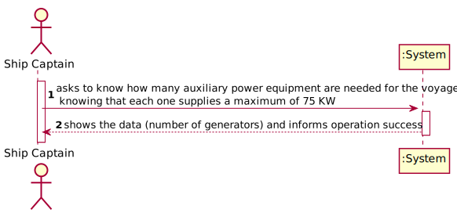
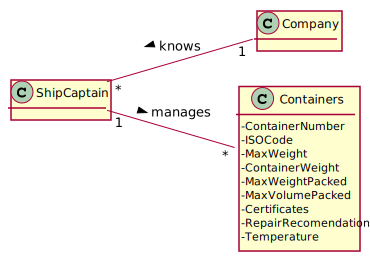
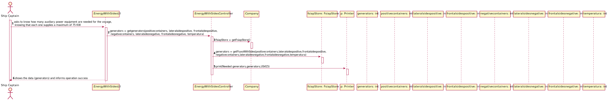
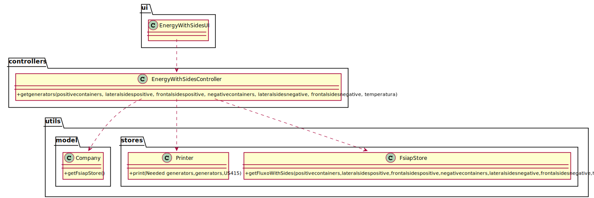

# US 415 - As the ship's captain I need to know how many auxiliary power equipment are needed for the voyage, knowing that each one supplies a maximum of 75 KW.

## 1. Requirements Engineering

### 1.1. User Story Description

As the ship's captain I need to know how many auxiliary power equipment are needed for the voyage, knowing that each one supplies a maximum of 75 KW.

### 1.2. Customer Specifications and Clarifications

From the client clarifications:

### 1.3. Acceptance Criteria

* AC1:"Know the amount of energy required per type of container for a trip."
* AC2:"Determine the total energy required to load containers on a given voyage (or route) as a function of their position in the load."
* AC3:"Determine how many generators of the stated power are required for the trip."

### 1.4. Found out Dependencies

### 1.5 Input and Output Data

Input Data

* Typed Data:
  
	* number of positive containers
	* number of lateral sides from the positive containers
	* number of frontal sides from the positive containers
	* number of negative containers
	* number of lateral sides from the negative containers
	* number of frontal sides from the negative containers
	* temperature

Output Data

* number of generators
* (In)Success of the operation

### 1.6. System Sequence Diagram (SSD)

### 1.7 Other Relevant Remarks

## 2. OO Analysis

### 2.1. Relevant Domain Model Excerpt

### 2.2. Other Remarks

## 3. Design - User Story Realization

### 3.1. Sequence Diagram (SD)

## 3.2. Class Diagram (CD)

# 4. Tests

**Test 1:**
		
	@Test
	void getgenerators() throws IOException {
	EnergyWithSidesController energyWithSidesController = new EnergyWithSidesController();
	String result = energyWithSidesController.getgenerators(10,2,20,10,12,20,20);
	String expected = "To maintain the temperature of 10 containers of -5ºC and 10 containers of 7ºC arranged in a specific way, 1 generators of 75KW are needed";
	Assertions.assertEquals(expected,result);
	}

		

