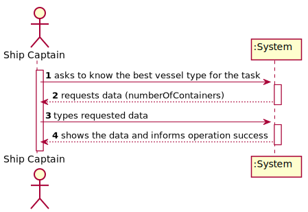
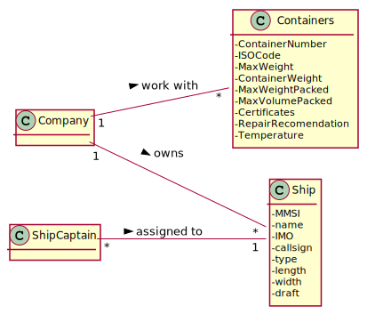
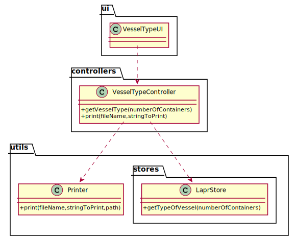

# US 417 - As the Ship Captain I want the technical team to search for at least three types of ship/vessels that are better suited to the task (e.g., depending on the type of cargo), in which the “control” bridge can assume three positions, one in the bow, one in the stern, and finally in the midship.

## 1. Requirements Engineering

### 1.1. User Story Description

As the Ship Captain I want the technical team to search for at least three types of ship/vessels that are better suited to the task (e.g., depending on the type of cargo), in which the “control” bridge can assume three positions, one in the bow, one in the stern, and finally in the midship.

### 1.2. Customer Specifications and Clarifications

From the client clarifications:

### 1.3. Acceptance Criteria

* AC1:"Search the different types of vessels for transporting different types of cargo. Containers, or solids in bulk."
* AC2:"Identify the differentiating characteristics."

### 1.4. Found out Dependencies

### 1.5 Input and Output Data

Input Data

* Typed data:
  	
	* number of containers

Output Data

* vessel type
* (In)Success of the operation

### 1.6. System Sequence Diagram (SSD)

### 1.7 Other Relevant Remarks

## 2. OO Analysis

### 2.1. Relevant Domain Model Excerpt

### 2.2. Other Remarks

## 3. Design - User Story Realization

### 3.1. Sequence Diagram (SD)

## 3.2. Class Diagram (CD)

# 4. Tests

**Test 1:** 

	@Test
    void getVesselType() throws IOException {
        VesselTypeController c = new VesselTypeController();
        String actual1 = c.getVesselType(4500);
        String actual2 = c.getVesselType(7500);
        String actual3 = c.getVesselType(16000);
        String expected1 = String.format("The best ship for the task is a Panamax.\nThis ship can transport up to 5100 containers.\nThe dimensions of this ship are 294x32x12 (m).\nWith tower in the stern\n");
        String expected2 = String.format("The best ship for the task is a New-Panamax.\nThis ship can transport up to 10000 containers.\nThe dimensions of this ship are 366x49x15 (m).\nWith tower in the middle\n");
        String expected3 = String.format("The best ship for the task is a Ultra Large Container Vessel.\nThis ship has capacity for more than 14500 containers.\nThis ship is bigger than 366x49x15 (m).\nWith tower in the bow\n");

        Assertions.assertEquals(actual1, expected1);
        Assertions.assertNotEquals(actual1, expected2);
        Assertions.assertNotEquals(actual1, expected3);

        Assertions.assertEquals(actual2, expected2);
        Assertions.assertNotEquals(actual2, expected1);
        Assertions.assertNotEquals(actual2, expected3);

        Assertions.assertEquals(actual3, expected3);
        Assertions.assertNotEquals(actual3, expected1);
        Assertions.assertNotEquals(actual3, expected2);
    }

