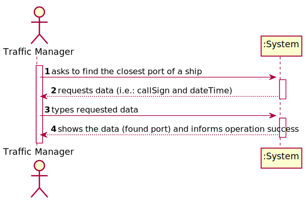
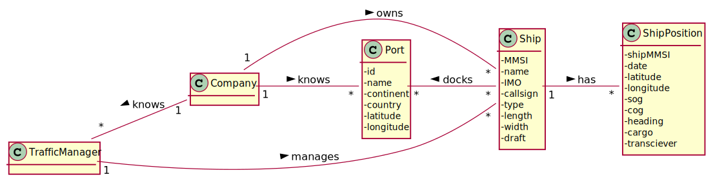
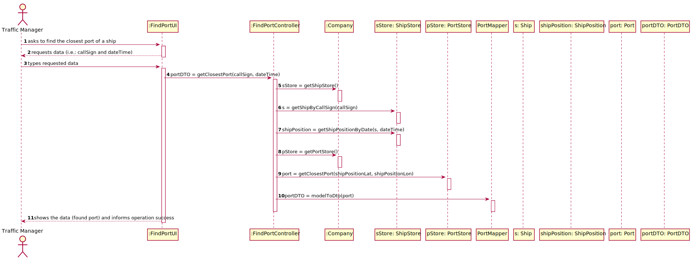
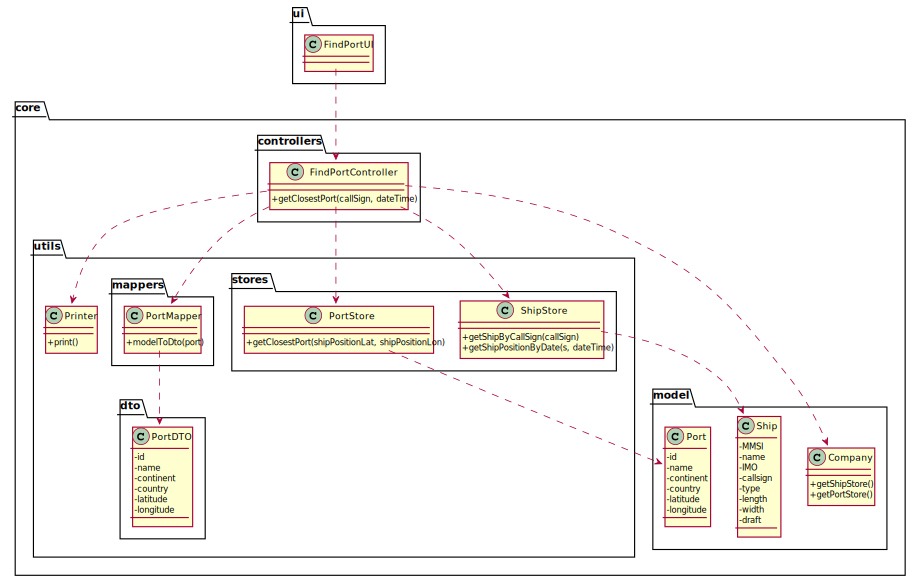

# US 202 - As a Traffic manager, I which to find the closest port of a ship given its CallSign, on a certain DateTime.

## 1. Requirements Engineering

### 1.1. User Story Description

As a Traffic manager, I which to find the closest port of a ship given its CallSign, on a certain DateTime.

### 1.2. Customer Specifications and Clarifications

From the client clarifications:

### 1.3. Acceptance Criteria

* AC1:"using 2D-tree to find closest port."

### 1.4. Found out Dependencies

* There is a dependency to "US201 As a Port manager, I which to import ports from a text file and create a 2D-tree with port locations" since the 2D tree must exist to find the port.

### 1.5 Input and Output Data

Input Data

* Typed data:
  	
	* call sign
	* date time

Output Data

* Found port
* (In)Success of the operation

### 1.6. System Sequence Diagram (SSD)

### 1.7 Other Relevant Remarks

## 2. OO Analysis

### 2.1. Relevant Domain Model Excerpt

### 2.2. Other Remarks

## 3. Design - User Story Realization

### 3.1. Sequence Diagram (SD)

## 3.2. Class Diagram (CD)

# 4. Tests

**Test 1:** 

		@Test
		void getClosestPort() throws ParseException, IOException {
			FindPortController fpc = new FindPortController();
			ShipStore shipStore = new ShipStore();
			PortStore portStore = new PortStore();
			fpc.setShipStore(shipStore);
			fpc.setPortStore(portStore);
			Ship ship = shipStore.createShip("210950000","VARAMO","IMO9395044","C4SQ2","70","166","25","9.5");
			shipStore.saveShipInBST(ship);
			shipStore.addShipPosition("210950000","31/12/2020 17:03","20.92236","-20.97243","12.5","2.4","358","NA","B");
			shipStore.addShipPosition("210950000","31/12/2020 17:04","42.92236","-66.97243","12.5","2.4","358","NA","B");
			Port port = portStore.createPort("29002","Liverpool","Europe","United Kingdom","20","-20");
			Port port1 = portStore.createPort("29001","Manchester","Europe","United Kingdom","25","-20");
			portStore.savePortinKdt(port);
			portStore.savePortinKdt(port1);
			PortDTO result = fpc.getClosestPort("C4SQ2","31/12/2020 17:03");
			PortDTO expected = new PortDTO("29002","Liverpool","Europe","United Kingdom","20","-20");
			Assertions.assertEquals(expected.toString(),result.toString());
		}

