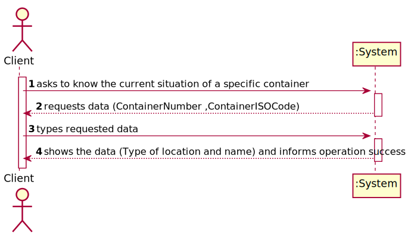
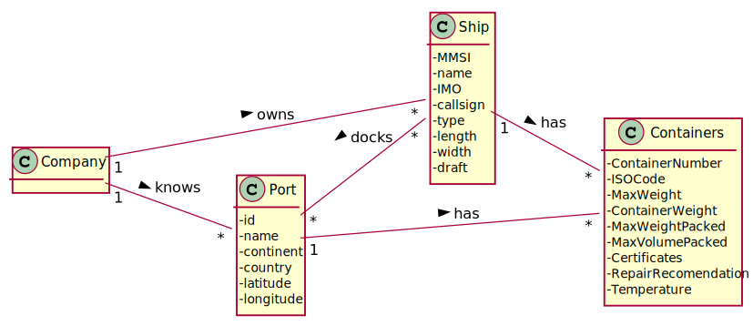
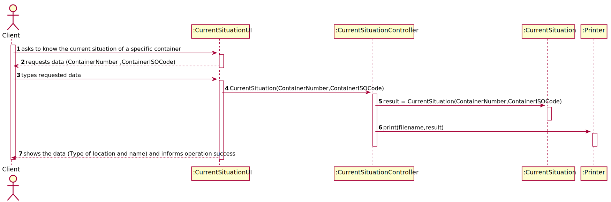
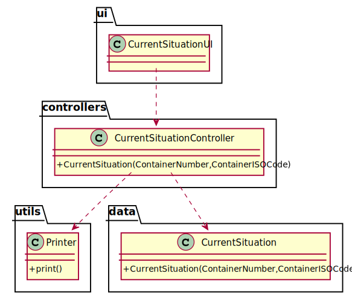

# US 204 - As Client, I want to know the current situation of a specific container being used to transport my goods.

## 1. Requirements Engineering

### 1.1. User Story Description

As Client, I want to know the current situation of a specific container being used to transport my goods.

### 1.2. Customer Specifications and Clarifications

From the client clarifications:

* Question: "Can a container have multiple shipments? If so, shouldn’t the client insert a shipment identifier?"
	* [Answer: ](https://moodle.isep.ipp.pt/mod/forum/discuss.php?d=12252) "Yes. I don't know how your application should support this, it is your decision."

### 1.3. Acceptance Criteria

* AC1:"Clients provide the container identifier and get the type and the concrete instance of its current location, e.g., PORT, Leixões or SHIP, WeFly."

### 1.4. Found out Dependencies

### 1.5 Input and Output Data

Input Data

* Typed data:
  	
	* container number
	* container ISO code

Output Data

* Type of location and name
* (In)Success of the operation

### 1.6. System Sequence Diagram (SSD)

### 1.7 Other Relevant Remarks

## 2. OO Analysis

### 2.1. Relevant Domain Model Excerpt

### 2.2. Other Remarks

## 3. Design - User Story Realization

### 3.1. Sequence Diagram (SD)

## 3.2. Class Diagram (CD)

