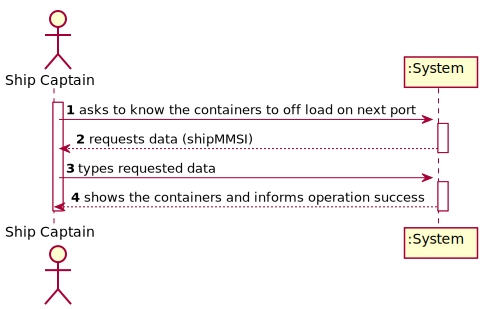
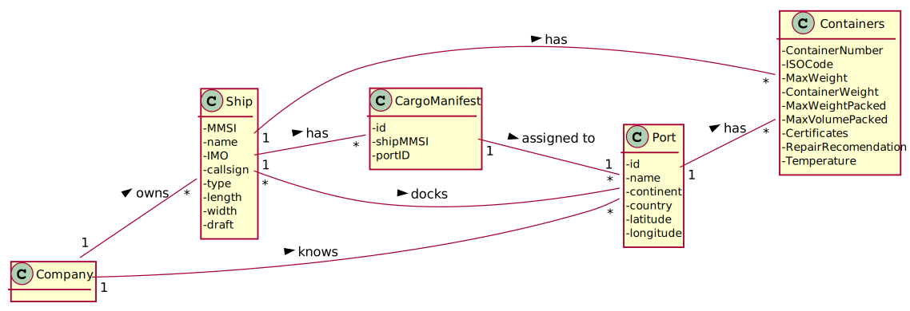
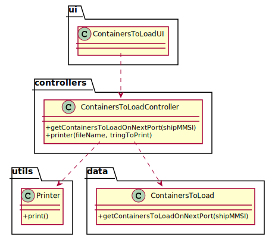

# US 206 - As Ship Captain, I want the list of containers to be loaded in the next port, including container identifier, type, and load.

## 1. Requirements Engineering

### 1.1. User Story Description

As Ship Captain, I want the list of containers to be loaded in the next port, including container identifier, type, and load.

### 1.2. Customer Specifications and Clarifications

From the client clarifications:

* Question: "According to the literature provided, Cargo Manifest is going to have a dynamical behavior, i e,  each time a Ship/Truck arrives at a Warehouse/Port it will deliver to the Staff a Cargo Manifest and, after the process of offloading and loading, the Staff will deliver to the Captain/Driver the new Cargo Manifest. Is this reading correct? If not could you clarify?"
	* [Answer:](https://moodle.isep.ipp.pt/mod/forum/discuss.php?d=12166) No. Partial cargo manifests are delivered to the team at the port and partial manifests are given to the ship's captain.

### 1.3. Acceptance Criteria

* AC1:"“next port” is properly identified."
* AC2:"The containers being loaded are properly identified."
* AC3:"Output is in accordance with the specification wrt the information about each container."

### 1.4. Found out Dependencies

### 1.5 Input and Output Data

Input Data

* Typed data:
  	
	* ship mmsi

Output Data

* Containers
* (In)Success of the operation

### 1.6. System Sequence Diagram (SSD)

### 1.7 Other Relevant Remarks

## 2. OO Analysis

### 2.1. Relevant Domain Model Excerpt

### 2.2. Other Remarks

## 3. Design - User Story Realization

### 3.1. Sequence Diagram (SD)

## 3.2. Class Diagram (CD)

