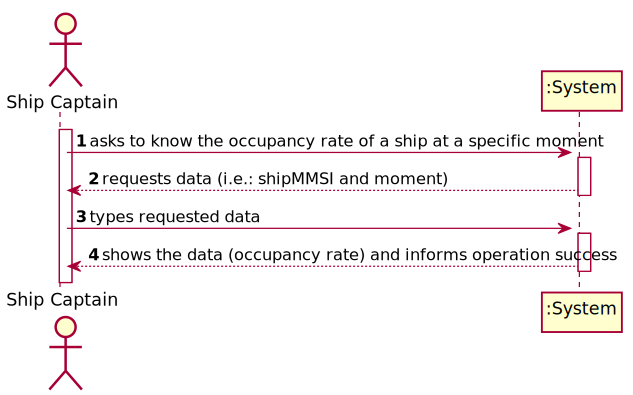
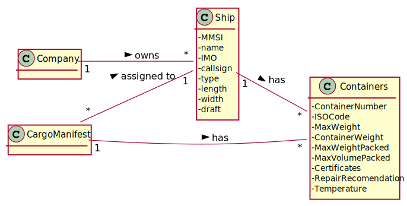
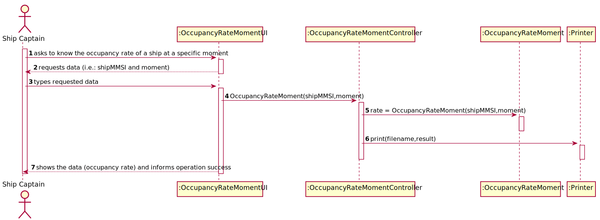
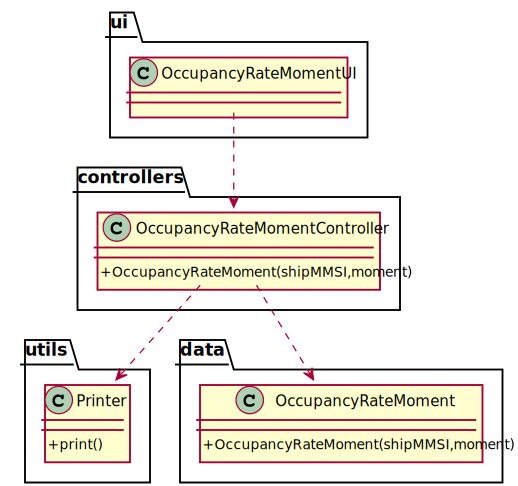

# US 209 - As Ship Captain, I want to know the occupancy rate of a given ship at a given moment.

## 1. Requirements Engineering

### 1.1. User Story Description

As Ship Captain, I want to know the occupancy rate of a given ship at a given moment.

### 1.2. Customer Specifications and Clarifications

From the client clarifications:

* Question: "In US209 the Ship Captain wants to know the occupancy rate of a given ship at a given moment. Does every cargo manifest have a date, associated with the time the ship arrived (unloading manifest) or left (loading manifest) the port?"
	* [Answer:](https://moodle.isep.ipp.pt/mod/forum/discuss.php?d=12117) "Yes, loading and unloading manifest should have a date when the procedure was finished."

### 1.3. Acceptance Criteria

* AC1:"Ship is properly identified."
* AC2:"Reuses US208."
* AC3:"Occupancy rate is properly computed."

### 1.4. Found out Dependencies

* There is a dependency to "US208 As Ship Captain, I want to know the occupancy rate (percentage) of a given ship for a given cargo manifest. Occupancy rate is the ratio between total number of containers in the ship coming from a given manifest and the total capacity of the ship, i.e., the maximum number of containers the ship can load." since like requested in AC2.

### 1.5 Input and Output Data

Input Data

* Typed data:
  	
	* ship mmsi
	* moment

Output Data

* Occupancy rate
* (In)Success of the operation

### 1.6. System Sequence Diagram (SSD)

### 1.7 Other Relevant Remarks

## 2. OO Analysis

### 2.1. Relevant Domain Model Excerpt

### 2.2. Other Remarks

## 3. Design - User Story Realization

### 3.1. Sequence Diagram (SD)

## 3.2. Class Diagram (CD)

