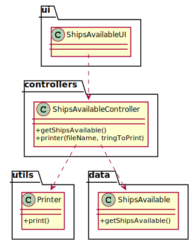

# US 210 - As Traffic manager, I need to know which ships will be available on Monday next week and their location.

## 1. Requirements Engineering

### 1.1. User Story Description

As Traffic manager, I need to know which ships will be available on Monday next week and their location.

### 1.2. Customer Specifications and Clarifications

From the client clarifications:

### 1.3. Acceptance Criteria

* AC1:"Monday next week is properly identified."
* AC2:"Only available ships are returned."
* AC3:"All available ships are returned."

### 1.4. Found out Dependencies

### 1.5 Input and Output Data

Output Data

* The monday next week
* The ships available and it's location
* (In)Success of the operation

### 1.6. System Sequence Diagram (SSD)

### 1.7 Other Relevant Remarks

## 2. OO Analysis

### 2.1. Relevant Domain Model Excerpt

### 2.2. Other Remarks

## 3. Design - User Story Realization

### 3.1. Sequence Diagram (SD)

## 3.2. Class Diagram (CD)

