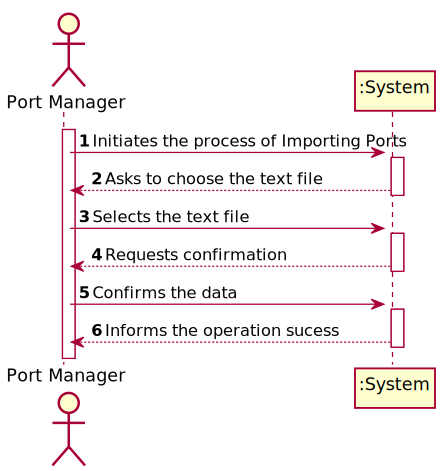
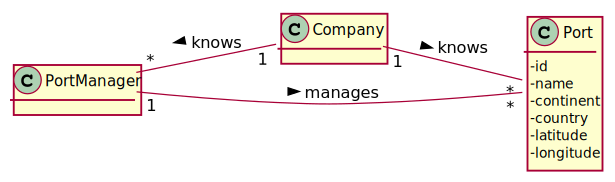
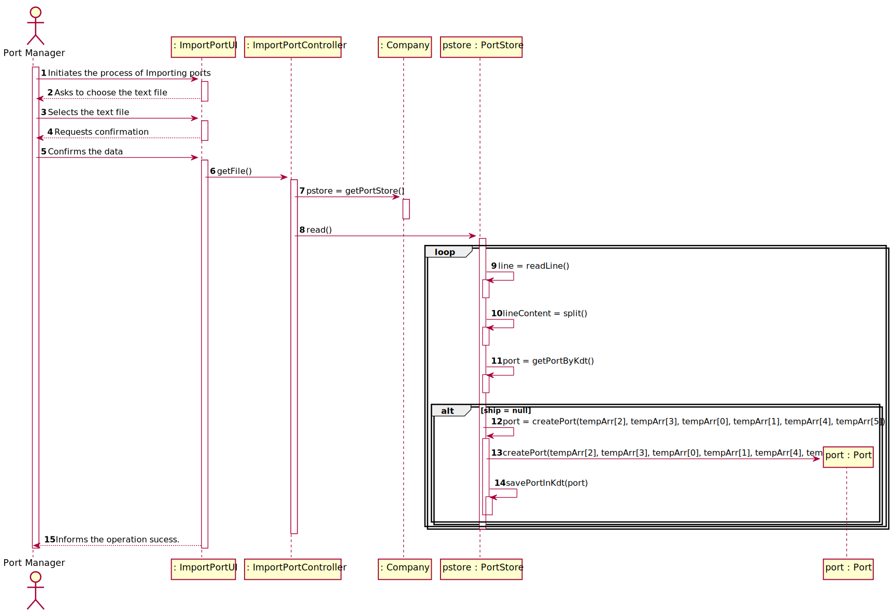
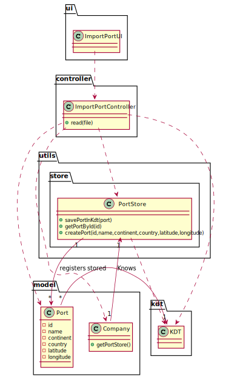

# US 201 - As a Port manager, I which to import ports from a text file and create a 2D-tree with port locations.
## 1. Requirements Engineering

### 1.1. User Story Description

As a Port manager, I which to import ports from a text file and create a 2D-tree with port locations.

### 1.2. Customer Specifications and Clarifications

From the client clarifications:
	
* Question: "Does the Port code has to follow a specific format?"
	* [Answer:](https://moodle.isep.ipp.pt/mod/forum/discuss.php?d=12112) "No."

### 1.3. Acceptance Criteria

* AC1:"2D-tree balanced."

### 1.4. Found out Dependencies

### 1.5 Input and Output Data

Input Data

* Selected data:
  	
	* csv file

Output Data

* (In)Success of the operation

### 1.6. System Sequence Diagram (SSD)

### 1.7 Other Relevant Remarks

## 2. OO Analysis

### 2.1. Relevant Domain Model Excerpt

### 2.2. Other Remarks

## 3. Design - User Story Realization

### 3.1. Sequence Diagram (SD)

## 3.2. Class Diagram (CD)

# 4. Tests

**Test 1:** 

		@Test
		void read() {
			ImportPortController controller = new ImportPortController(App.getInstance().getCompany());
			try {
				controller.read(null);
				Assertions.fail("There should have been an exception");
			} catch (NullPointerException | IOException | ParseException e) {
				e.printStackTrace();
			}
		}

