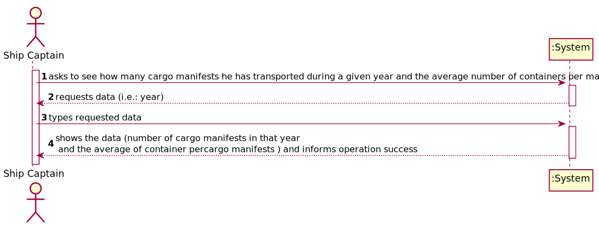
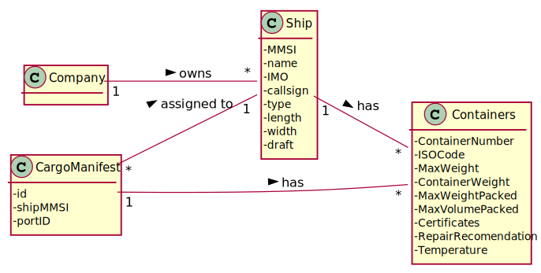
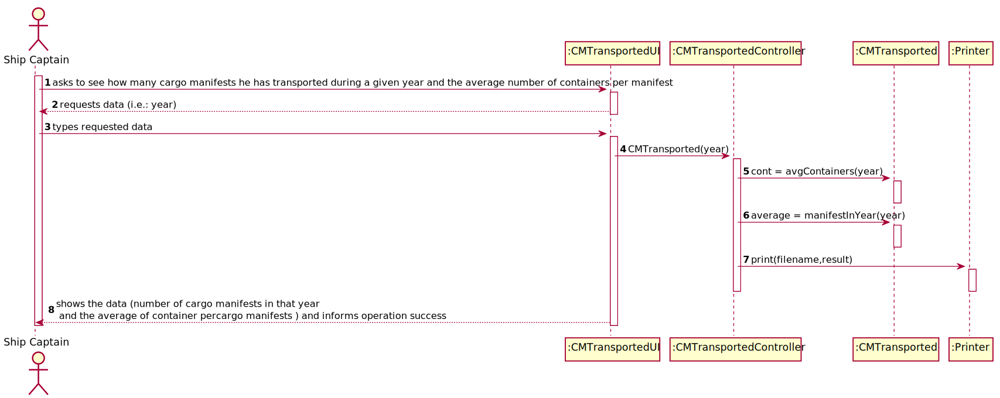
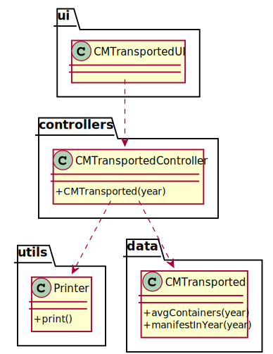

# US 207 -  As Ship Captain, I want to know how many cargo manifests I have transported during a given year and the average number of containers per manifest.

## 1. Requirements Engineering

### 1.1. User Story Description

As Ship Captain, I want to know how many cargo manifests I have transported during a given year and the average number of containers per manifest.

### 1.2. Customer Specifications and Clarifications

From the client clarifications:

### 1.3. Acceptance Criteria

* AC1:"Only the cargo manifests of the specified year are considered"
* AC2:"Average containers per cargo manifest are properly computed"

### 1.4. Found out Dependencies

### 1.5 Input and Output Data

Input Data

* Typed data:
  	
	* year

Output Data

* Number of cargo manifests in that year
* Average of container percargo manifests
* (In)Success of the operation

### 1.6. System Sequence Diagram (SSD)

### 1.7 Other Relevant Remarks

## 2. OO Analysis

### 2.1. Relevant Domain Model Excerpt

### 2.2. Other Remarks

## 3. Design - User Story Realization

### 3.1. Sequence Diagram (SD)

## 3.2. Class Diagram (CD)

