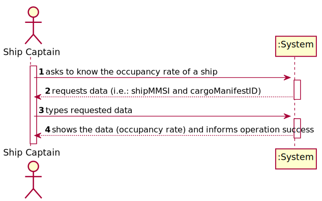
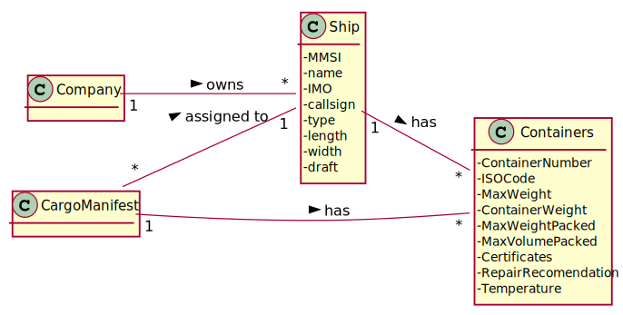
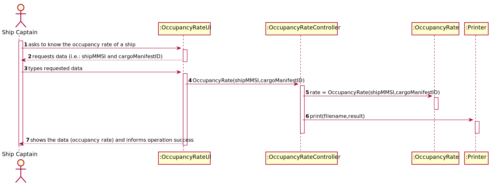
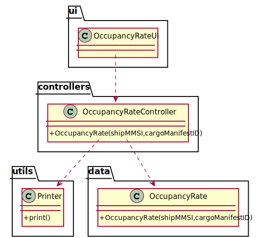

# US 208 - As Ship Captain, I want to know the occupancy rate (percentage) of a given ship for a given cargo manifest. Occupancy rate is the ratio between total number of containers in the ship coming from a given manifest and the total capacity of the ship, i.e., the maximum number of containers the ship can load.

## 1. Requirements Engineering

### 1.1. User Story Description

As Ship Captain, I want to know the occupancy rate (percentage) of a given ship for a given cargo manifest. Occupancy rate is the ratio between total number of containers in the ship coming from a given manifest and the total capacity of the ship, i.e., the maximum number of containers the ship can load.

### 1.2. Customer Specifications and Clarifications

From the client clarifications:

* Question: "Should the ship captain insert the ship identifier, or should the system know automatically which ship to show? In US208 it leads us to thinking that the ship captain can see any given ship."
	* [Answer:](https://moodle.isep.ipp.pt/mod/forum/discuss.php?d=12253) "Ship captains should only be able to see information related to "their" ships, not all. If your system can guess which ship the captain is thinking about when using this requirement, great."
* Question: "The max capacity of a ship is given as an attribute in m3.  How can we convert that value in number of containers? We also don't have information of their size (just LxWxH)..."
	* [Answer:](https://moodle.isep.ipp.pt/mod/forum/discuss.php?d=12248) "Given that, just use your your container dimensions to check how many containers can a ship hold."
* Question: "In US208 the Ship Captain wants to know the occupancy rate of a given ship for a given cargo manifest. Does every cargo manifest have a unique id? If so, please tell us the requirements of this id."
	* [Answer:](https://moodle.isep.ipp.pt/mod/forum/discuss.php?d=12116) Each cargo manifest can have an Identification number. Whether this number is timestamped, unique for one trip or for the whole system, it depends on how you analyse it. You should take into consideration advantages/disadvantages of different approaches.

### 1.3. Acceptance Criteria

* AC1:"Ship and cargo manifest are correctly identified."
* AC2:"Occupancy rate is properly computed."

### 1.4. Found out Dependencies

### 1.5 Input and Output Data

Input Data

* Typed data:
  	
	* ship mmsi
	* cargo manifest id

Output Data

* Occupancy rate
* (In)Success of the operation

### 1.6. System Sequence Diagram (SSD)

### 1.7 Other Relevant Remarks

## 2. OO Analysis

### 2.1. Relevant Domain Model Excerpt

### 2.2. Other Remarks

## 3. Design - User Story Realization

### 3.1. Sequence Diagram (SD)

## 3.2. Class Diagram (CD)

