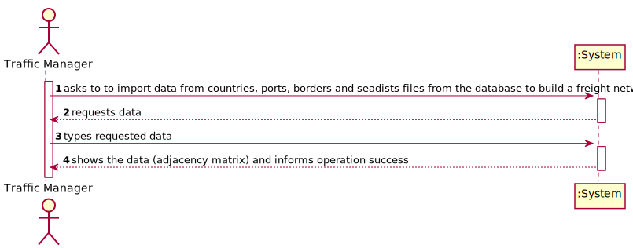
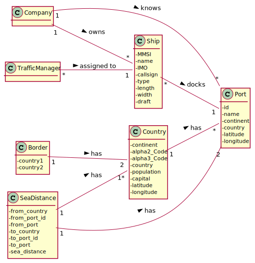
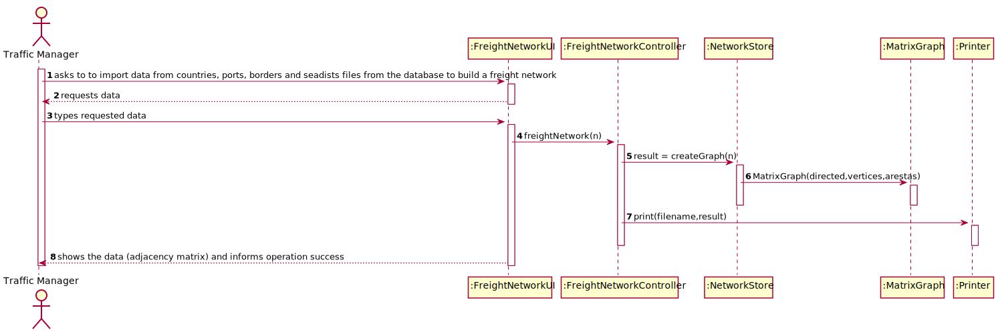
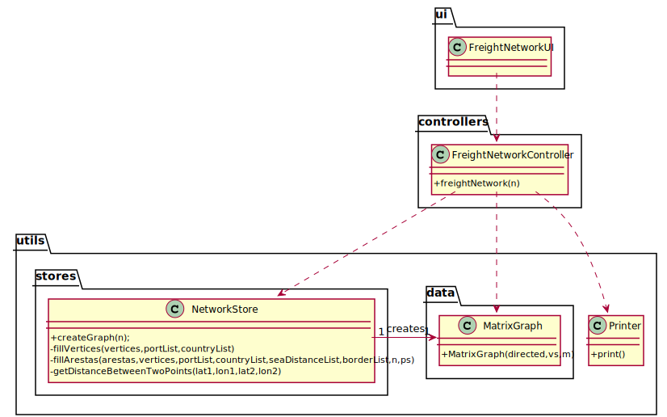

# US 301 - As a Traffic manager, I which to import data from countries, ports, borders and seadists from the database to build a freight network.

## 1. Requirements Engineering

### 1.1. User Story Description

As a Traffic manager, I which to import data from countries, ports, borders and seadists from the database to build a freight network.

### 1.2. Customer Specifications and Clarifications

From the client clarifications:

* Question: "It is specified that each port from a given country is conected to eachother, and the n closest ports of any other country. My questions is if those conections are made by us or if they are already specified in the seadist file."
	* [Answer:](https://moodle.isep.ipp.pt/mod/forum/discuss.php?d=12675) "As ligações são por vocês implementadas de acordo com os critérios definidos na US301"

* Question: "While lokking arround the files our group noticed that some of the conections in the seadist file has some ports that are not specified in the ports file. What should be our aproach to this problem."
	* [Answer:](https://moodle.isep.ipp.pt/mod/forum/discuss.php?d=12676) "Since I was given no options, I would say that in this situations you should create the ports."

* Question: "For the value n - "...and finally, each port of a country connects with the n closest ports of any other country." - Should we allow the Traffic Manager to input this values or should it be a fixed value?"
	* [Answer:](https://moodle.isep.ipp.pt/mod/forum/discuss.php?d=12749) "n é um parâmetro a definir no testes."

* Question: "Com a frase "...ensuring the indistinct manipulation of capitals and seaports." significa que deveremos assegurar a criação de apenas um só grafo que permita a manipulação tanto de portos e capitais? Peço desculpa pela pergunta mas não fiquei inteiramente esclarecido com o Enunciado."
	* [Answer:](https://moodle.isep.ipp.pt/mod/forum/discuss.php?d=12750) "Com manipulação indistinta de capitais e portos, pretende-se que construam um só grafo cujos vértices tanto podem ser capitais como portos e percorrem-nos sem necessidade de código adicional para verificar o seu tipo."

* Question: "Do you want to map the connection of cities (besides Capitals) in the freight network? I E, if we want to insert Porto and Lisboa should there be mapped a connection between this 2 cities or we should just ignore this?"
	* [Answer:](https://moodle.isep.ipp.pt/mod/forum/discuss.php?d=12753) "Só deve considerar as capitais e os portos fornecidos."

* Question: "O que define os n portos mais perto? Temos de perguntar ao user?"
	* [Answer:](https://moodle.isep.ipp.pt/mod/forum/discuss.php?d=12761) "Os n portos mais perto é um parâmetro (n) que deverão definir nos testes."

* Question: "Como é que deveremos proceder quando o porto mais próximo não é do próprio país? Não tenho a certeza se existem casos em que tem portos mas o mais próximo não é do país. Mas há muitos que não têm portos. Ignoramos a conexão com a capital? P.ex. hungria (não tem portos no bports, certamente por ser não ter acesso a mar)"
	* [Answer:](https://moodle.isep.ipp.pt/mod/forum/discuss.php?d=12813) "Se o país não tem portos, não tem como fazer ligações de portos com a capital."

* Question: "Surgiu a dúvida no nosso Grupo. O Grafo vai ter como pesos entre Capitais/Cidades a distância calculada através das informações dadas e entre os Portos as distancias fornecidas? Sendo que o Calculo entre Porto e Capital é feito como se o Porto fosse uma Capital, i e, pelas suas coordenadas?"
	* [Answer:](https://moodle.isep.ipp.pt/mod/forum/discuss.php?d=12843) "As distancias terrestres são calculadas através das coordenadas geográficas com a formula fornecida no Sprint1. As distancias marítimas (entre portos) são as fornecidas no fx. seadists."

* Question: "A US301 pede para irmos à base de dados buscar a informação que precisamos para por no grafo. Podemos fazer o sort das listas recebidas pelas queries de sql pela propria querie ou temos que fazer o sort pelo java?"
	* [Answer:](https://moodle.isep.ipp.pt/mod/forum/discuss.php?d=12911) "Se o sort for necessário para a criação do grafo, deve fazer no Java."

### 1.3. Acceptance Criteria

* AC1:"The capital of a country has a direct connection with the capitals of the countries with which it borders. The ports of a country, besides connecting with all the ports of the same country, the port closest to the capital of the country connects with it; and finally, each port of a country connects with the n closest ports of any other country."
* AC2:"The calculation of distances in Kms between capitals, and ports and capitals must be done using the GPS coordinates."
* AC3:"The graph must be implemented using the adjacency matrix representation and ensuring the indistinct manipulation of capitals and seaports."

### 1.4. Found out Dependencies

### 1.5 Input and Output Data

Input Data

Output Data

* (In)Success of the operation

### 1.6. System Sequence Diagram (SSD)

### 1.7 Other Relevant Remarks

## 2. OO Analysis

### 2.1. Relevant Domain Model Excerpt

### 2.2. Other Remarks

## 3. Design - User Story Realization

### 3.1. Sequence Diagram (SD)

## 3.2. Class Diagram (CD)

# 4. Tests

**Test 1:** 

		@Test
		void freightNetwork() throws SQLException, IOException {
        FreightNetworkController freightNetworkController = new FreightNetworkController();
        boolean result=freightNetworkController.freightNetwork(3);
        assertTrue(result);
    	}
		

