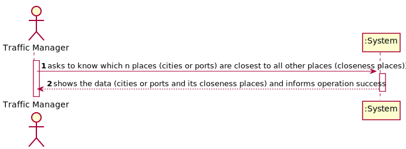
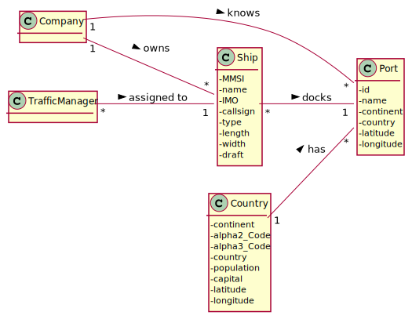
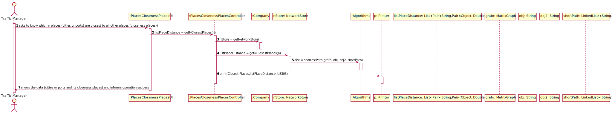
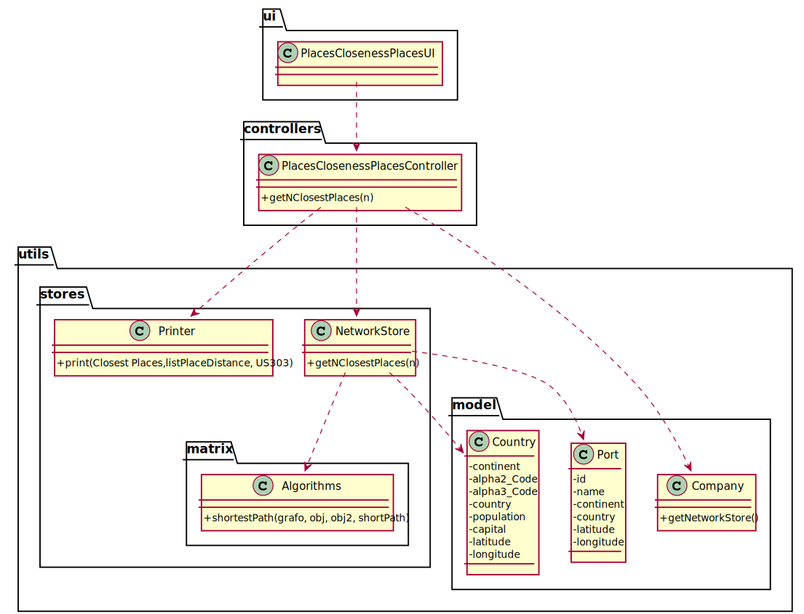

# US 303 - As a Traffic manager I wish to know which places (cities or ports) are closest to all other places (closeness places).

## 1. Requirements Engineering

### 1.1. User Story Description

As a Traffic manager I wish to know which places (cities or ports) are closest to all other places (closeness places).

### 1.2. Customer Specifications and Clarifications

From the client clarifications:

* Question: "In US303, "As a Traffic manager I wish to know which places (cities or ports) are closest to all other places (closeness places)", the cities are the same as capitals? Because in the provided files the only cities are the capitals."
	* [Answer:](https://moodle.isep.ipp.pt/mod/forum/discuss.php?d=12777) "As cidades são as capitais"

* Question: "In US303 we should return the n closest locals by continent, but should we calculate the closest locals by comparing them with locals from all over the world or just from their respective continent?"
	* [Answer:](https://moodle.isep.ipp.pt/mod/forum/discuss.php?d=12650) "Should only consider the locations of the continent."

### 1.3. Acceptance Criteria

* AC1:"Return the n closeness locals by continent."
* AC2:"The measure of proximity is calculated as the average of the shortest path length from the local to all other locals in the network."

### 1.4. Found out Dependencies

* There is a dependency to "US301 - As a Traffic manager, I which to import data from countries, ports, borders and seadists files from the database to build a freight network." since the graph must exist to show the closest places by continent.

### 1.5 Input and Output Data

Input Data

* Typed data:
  	
	* number of places

Output Data

* closest places by continent
* (In)Success of the operation

### 1.6. System Sequence Diagram (SSD)

### 1.7 Other Relevant Remarks

## 2. OO Analysis

### 2.1. Relevant Domain Model Excerpt

### 2.2. Other Remarks

## 3. Design - User Story Realization

### 3.1. Sequence Diagram (SD)

## 3.2. Class Diagram (CD)

# 4. Tests

**Test 1:** 

		@Test
		void getNClosestPlaces() throws SQLException, IOException {
        PlacesClosenessPlacesController placesClosenessPlacesController = new PlacesClosenessPlacesController();
        NetworkStore networkStore = new NetworkStore();
        networkStore.setGrafo(completeMap);
        networkStore.setCountryList(countries);
        networkStore.setPortList(ports);
        placesClosenessPlacesController.setNetworkStore(networkStore);
        List<Pair<String, Pair<Object, Double>>> expected = placesClosenessPlacesController.getNClosestPlaces(2);
        List<Pair<String, Pair<Object,Double>>> result=new ArrayList<>();
        Pair<Object,Double> pair = new Pair<>(new Port("77777","port3","Europe","Italia","0","0"),4.86);
        Pair<Object,Double> pair1 = new Pair<>(new Port("66677","port2","Europe","Espanha","0","0"),6.459999999999999);
        Pair<String,Pair<Object,Double>> pairPair= new Pair<>("Europe",pair);
        Pair<String,Pair<Object,Double>> pairPair1= new Pair<>("Europe",pair1);
        result.add(pairPair);
        result.add(pairPair1);
        Assertions.assertEquals(expected,result);
  		}

