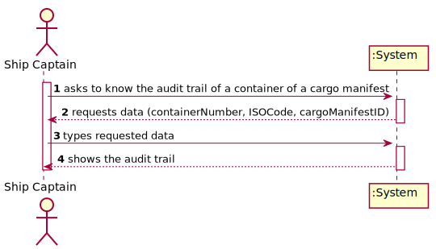
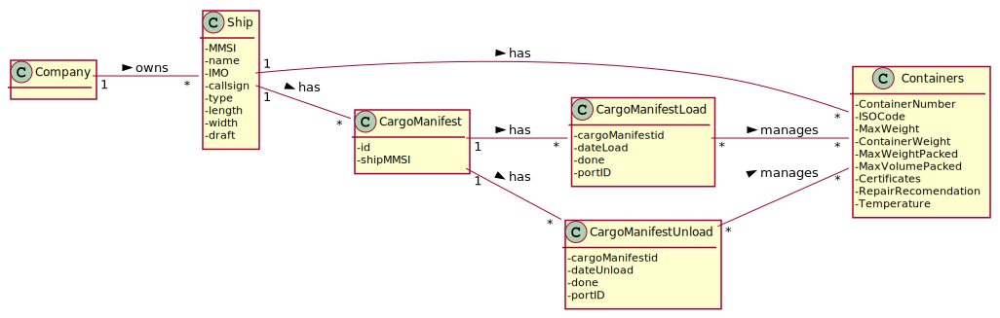
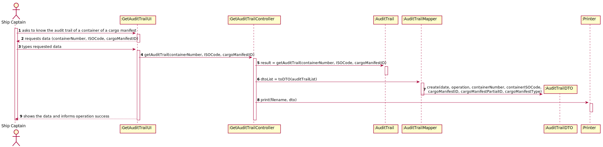
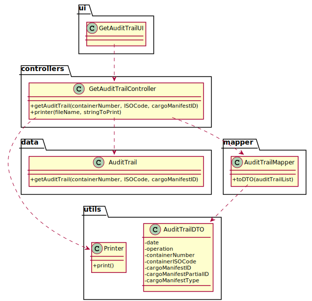

# US 304 - As Ship Captain, I want to have access to audit trails for a given container of a given cargo manifest, that is, I want to have access to a list of all operations performed on a given container of a given manifest, in chronological order. For each operation I want to know: the user/login that performed it, the date and time the operation was performed, the type of operation (INSERT, UPDATE, DELETE), the container identifier and the cargo manifest identifier.

## 1. Requirements Engineering

### 1.1. User Story Description

As Ship Captain, I want to have access to audit trails for a given container of a given cargo manifest, that is, I want to have access to a list of all operations performed on a given container of a given manifest, in chronological order. For each operation I want to know: the user/login that performed it, the date and time the operation was performed, the type of operation (INSERT, UPDATE, DELETE), the container identifier and the cargo manifest identifier.

### 1.2. Customer Specifications and Clarifications

From the client clarifications:

### 1.3. Acceptance Criteria

* AC1:"There is a table for recording audit trails, i.e., record all write-operations involving containers of a cargo manifest."
* AC2:"Proper mechanisms for recording write-operations involving containers of a cargo manifest are implemented (INSERT, UPDATE, DELETE)."
* AC3:"A simple and effective audit trail consultation process is implemented."

### 1.4. Found out Dependencies

### 1.5 Input and Output Data

Input Data

* Typed data:
  	
	* containerNumber
	* ISOCode
	* cargoManifestID

Output Data

* audit trails
* (In)Success of the operation

### 1.6. System Sequence Diagram (SSD)

### 1.7 Other Relevant Remarks

## 2. OO Analysis

### 2.1. Relevant Domain Model Excerpt

### 2.2. Other Remarks

## 3. Design - User Story Realization

### 3.1. Sequence Diagram (SD)

## 3.2. Class Diagram (CD)

# 4. Tests

**Test 1:** 

		@Test
		void getAuditTrail() throws SQLException, IOException {
        GetAuditTrailController c = new GetAuditTrailController();
        Assertions.assertFalse(c.getAuditTrail("67645", "6465", "78754545"));
        Assertions.assertTrue(c.getAuditTrail("78546321458", "4785", "11111"));
        Assertions.assertNotEquals(false, c.getAuditTrail("78546321458", "4785", "11111"));
        Assertions.assertNotEquals(true, c.getAuditTrail("67645", "6465", "78754545"));
		}

