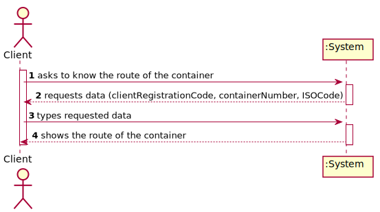
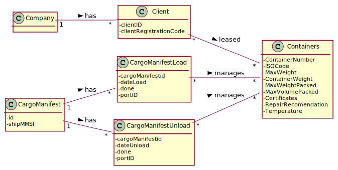
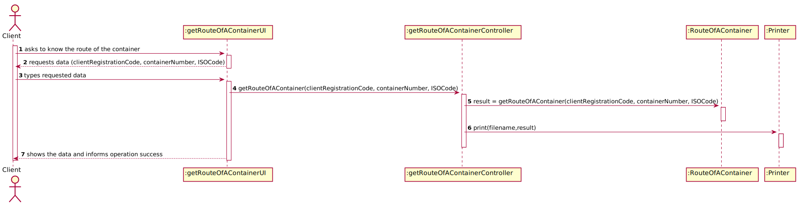
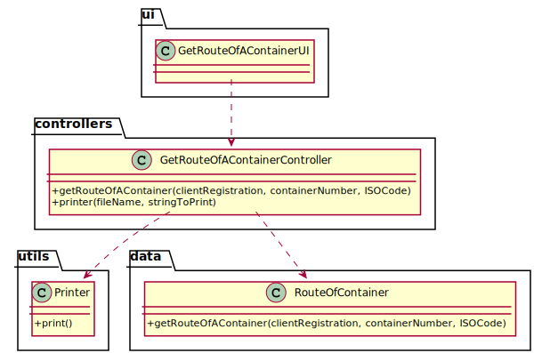

# US 305 - As Client, I want to know the route of a specific container I am leasing.

## 1. Requirements Engineering

### 1.1. User Story Description

As Client, I want to know the route of a specific container I am leasing.

### 1.2. Customer Specifications and Clarifications

From the client clarifications:

* Question: "In the US305 we get from the US description that the client types a registration code. Is that similar to a login? If its not is it ok to change for a login?"
	* [Answer:](https://moodle.isep.ipp.pt/mod/forum/discuss.php?d=12576) "Registration code is the "business" identifier of the client. It should not be the login."

* Question: "in case the client asks to know the route of a container when it is in the middle of the ocean, a time of arrival won't exist. Should we calculate it or estimate it?"
	* [Answer:](https://moodle.isep.ipp.pt/mod/forum/discuss.php?d=12687) "when a ship leaves on a trip it should have an estimated time of arrival at each port in the route. This is the time of arrival we will use when the ship is in the ocean between two ports. we just need to know the ship is "in transit between port A and port B"; we dont need the position coordinates"
	

### 1.3. Acceptance Criteria

* AC1:"Users provide their registration code, the container identifier and get its path, from source to current location indicating time of arrival and departure at each location and mean of transport (ship or truck) between each pair of locations."
* AC2:"When the provided identifier is not valid or, being valid, is not leased by the client, a warning is returned."

### 1.4. Found out Dependencies

### 1.5 Input and Output Data

Input Data

* Typed data:
  	
	* clientRegistrationCode
	* containerNumber
	* ISOCode

Output Data

* route of the container
* (In)Success of the operation

### 1.6. System Sequence Diagram (SSD)

### 1.7 Other Relevant Remarks

## 2. OO Analysis

### 2.1. Relevant Domain Model Excerpt

### 2.2. Other Remarks

## 3. Design - User Story Realization

### 3.1. Sequence Diagram (SD)

## 3.2. Class Diagram (CD)

# 4. Tests

**Test 1:** 

		@Test
		void getRouteOfAContainer() throws SQLException, IOException {
        GetRouteOfAContainerController c = new GetRouteOfAContainerController();
        Assertions.assertFalse(c.getRouteOfAContainer("6654","6876874"));
        Assertions.assertTrue(c.getRouteOfAContainer("12345", "78546321458"));
        Assertions.assertNotEquals(false, c.getRouteOfAContainer("12345", "78546321458"));
        Assertions.assertNotEquals(true, c.getRouteOfAContainer("6654","6876874"));
    	}

