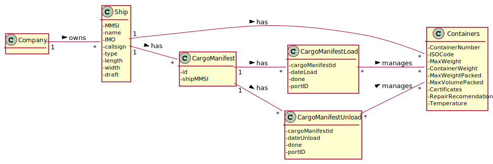

# US 308 - As Traffic manager, I want to have a system that ensures that the number of containers in a manifest does not exceed the ship's available capacity.

## 1. Requirements Engineering

### 1.1. User Story Description

As Traffic manager, I want to have a system that ensures that the number of containers in a manifest does not exceed the ship's available capacity.

### 1.2. Customer Specifications and Clarifications

From the client clarifications:

### 1.3. Acceptance Criteria

* AC1:"The destination ship is properly identified."
* AC2:"Ship’s available capacity is properly computed."
* AC3:"The warning is triggered when required."

### 1.4. Found out Dependencies

### 1.5 Input and Output Data

Input Data

Output Data

* container full or not
* (In)Success of the operation

### 1.6. System Sequence Diagram (SSD)

### 1.7 Other Relevant Remarks

## 2. OO Analysis

### 2.1. Relevant Domain Model Excerpt

### 2.2. Other Remarks

## 3. Design - User Story Realization

### 3.1. Sequence Diagram (SD)

## 3.2. Class Diagram (CD)

# 4. Tests

**Test 1:** 

		@Test
		void containerCapacity() throws SQLException, IOException {
        ContainerCapacityController c = new ContainerCapacityController();
        Assertions.assertTrue(c.containerCapacity());
        Assertions.assertNotEquals(false, c.containerCapacity());
    	}

