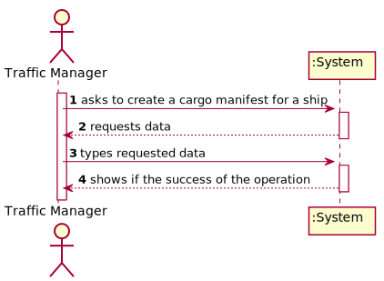
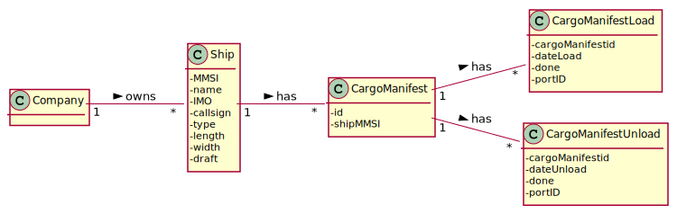
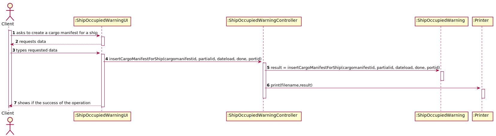

# US 309 - As Traffic manager, I do not allow a cargo manifest for a particular ship to be registered in the system on a date when the ship is already occupied.

## 1. Requirements Engineering

### 1.1. User Story Description

As Traffic manager, I do not allow a cargo manifest for a particular ship to be registered in the system on a date when the ship is already occupied.

### 1.2. Customer Specifications and Clarifications

From the client clarifications:

### 1.3. Acceptance Criteria

* AC1:"The ship is properly identified."
* AC2:"Ship’s availability is properly computed."
* AC3:"A warning or an exception is triggered when required."

### 1.4. Found out Dependencies

### 1.5 Input and Output Data

Input Data

* Typed data:
  	
	* cargoManifestID
	* partialID
	* dateLoad
	* done
	* portID

Output Data

* (In)Success of the operation

### 1.6. System Sequence Diagram (SSD)

### 1.7 Other Relevant Remarks

## 2. OO Analysis

### 2.1. Relevant Domain Model Excerpt

### 2.2. Other Remarks

## 3. Design - User Story Realization

### 3.1. Sequence Diagram (SD)

## 3.2. Class Diagram (CD)

# 4. Tests

**Test 1:** 

		@Test
		void insertCargoManifestForShip() throws SQLException, IOException {
        ShipOccupiedController c = new ShipOccupiedController();
        assertTrue(c.insertCargoManifestForShip("11113", "1", "2021-02-21 00:07:01", "0", "12345"));
        assertFalse(c.insertCargoManifestForShip("11111", "2", "2021-02-21 00:10:01", "0", "12345"));
        assertNotEquals(false, c.insertCargoManifestForShip("11113", "1", "2021-02-21 00:07:01", "0", "12345"));
        assertNotEquals(true, c.insertCargoManifestForShip("11111", "2", "2021-02-21 00:10:01", "0", "12345"));
    	}

