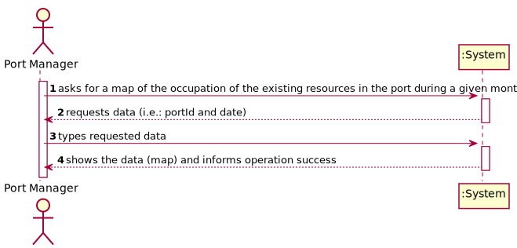
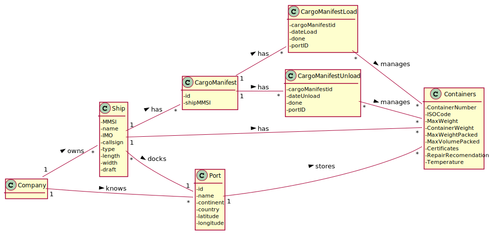
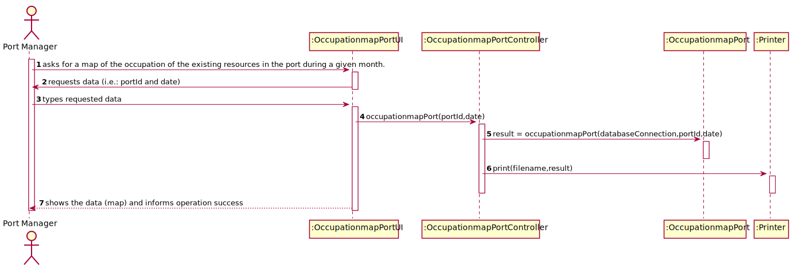
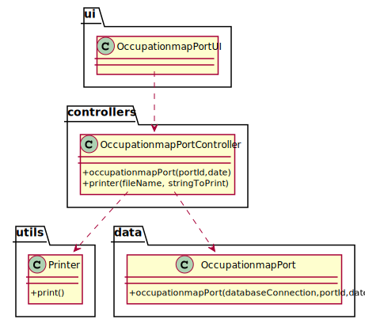

# US 310 - As Port manager, I intend to have a map of the occupation of the existing resources in the port during a given month.

## 1. Requirements Engineering

### 1.1. User Story Description

As Port manager, I intend to have a map of the occupation of the existing resources in the port during a given month.

### 1.2. Customer Specifications and Clarifications

From the client clarifications:

* Question: "In US310   requiers "a map of the occupation of the existing resources in the port during a given month" , what kind of resources are talking about. Is the containers , Ship and trucks."
	* [Answer:](https://moodle.isep.ipp.pt/mod/forum/discuss.php?d=12595) "containers and ships area a must. It would be nice to have Trucks as well."

* Question: "When you say, "containers and ships area", we understand that we need to specify the total port capacity in ships anchored, total storage area for containers and total number of trucks allowed in port. Is this correct?"
	* [Answer:](https://moodle.isep.ipp.pt/mod/forum/discuss.php?d=12595) "Occupation map is supposed to be a list of the assets available in the port (docking area, warehouses, staff, loading and unloading equipment/vehicles) and their occupancy rate evolution along the month. Lets limit this list of resources to the docking area and warehouses. So, what you have to provide for US30 is a list of the evolution along a given month of the occupancy rate of the port's docking area and warehouses. Occupancy rate of a docking area is the percentage of occupied docking slots while that of a warehouse is the percentage of the net volume occupied (for simplicity lets assume that the warehouse net volume is given in number of containers, regardless of their dimensions)"

### 1.3. Acceptance Criteria

* AC1:"Occupation of resources is restricted to the month provided."
* AC2:"The reported occupation respects actual port capacity."

### 1.4. Found out Dependencies

### 1.5 Input and Output Data

Input Data

* Typed data:
  	
	* portID
	* date

Output Data

* map
* (In)Success of the operation

### 1.6. System Sequence Diagram (SSD)

### 1.7 Other Relevant Remarks

## 2. OO Analysis

### 2.1. Relevant Domain Model Excerpt

### 2.2. Other Remarks

## 3. Design - User Story Realization

### 3.1. Sequence Diagram (SD)

## 3.2. Class Diagram (CD)

# 4. Tests

**Test 1:** 

		@Test
		void occupationmapPort() throws SQLException, IOException {
        OccupationmapPortController opc = new OccupationmapPortController();
        boolean result = opc.occupationmapPort("98798","2021-03-01 00:00:00");
        assertTrue(result);
    	}

