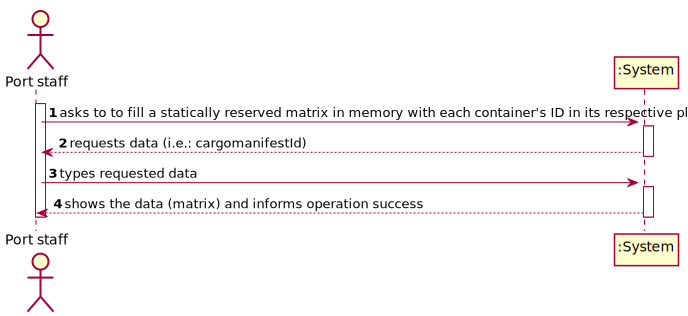
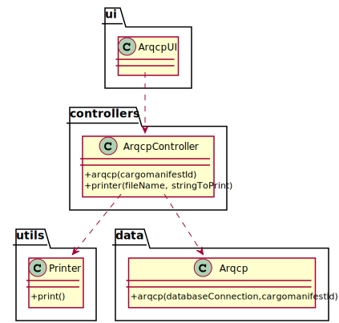

# US 313 - As a Port staff, given a Cargo Manifest, I wish to fill a statically reserved matrix in memory with each container's ID in its respective place.

## 1. Requirements Engineering

### 1.1. User Story Description

As a Port staff, given a Cargo Manifest, I wish to fill a statically reserved matrix in memory with each container's ID in its respective place.

### 1.2. Customer Specifications and Clarifications

From the client clarifications:

* Question: "Boa noite professor, Não conseguimos perceber como devemos obter os dados para preencher a matriz. Poderia, por favor, dar alguma indicação nesse sentido? obrigado desde já,"
  * [Answer:](https://moodle.isep.ipp.pt/mod/forum/discuss.php?d=12661) "O manifesto de carga deve indicar, pelo menos, a posição de cada contentor e o seu ID. Isso vem do projecto integrador e não é específico de ARQCP.
Segundo sei, têm total liberdade para determinar qual o formato que pretendem para esse ficheiro. Pode, por exemplo, ter os campos da posição e o ID do contentor separados por , ou ;, indicando cada um dos contentores por linha. "

* Question: "Considerando a criação e preenchimento da matriz descrito na US 313, na página 4 do enunciado a descrição dos containers estabelece um sistema de localização de 3 eixos ( x,y,z ) e em particular a coordenada z poder ter valores negativos."... Ships may have containers below that axis using a negative number for the “z” axis."
Pode por favor ajudar a esclarecer este ponto, isto é, devemos consideração a manipulação da matriz com índices negativos?"
  * [Answer:](https://moodle.isep.ipp.pt/mod/forum/discuss.php?d=12705) "Podem mapear esses valores num conjunto de valores positivos. Por exemplo, assumindo a escala -10 a 10 na posição dos contentores, conseguem facilmente mapear na escala 0 a 20, que seria a escala usada na matriz.
Uma alternativa menos interessante seria apenas considerar os contentores com valores positivos.
Reparem que no Sprint 3, nas USs relativas a ARQCP, depois da matriz estar preenchida, é completamente indiferente a escala ou transformação que foi usada."
* Question: "O nosso grupo gostaria de saber se, tal como foi feito com a UC de BDDAD, nos vão dar as classes/métodos necessários para fazer a ligação do C ao Java?"
	* [Answer:](https://moodle.isep.ipp.pt/mod/forum/discuss.php?d=12872) "Qualquer integração entre a aplicação em C e a de Java é um requisito de LAPR3 e não de ARQCP. No entanto, neste semestre, a única forma de integração que vos pode ser pedida é através do uso de ficheiros. Assim, neste Sprint 3, a existir integração será na exportação do manifesto de carga por parte da aplicação em Java e a respectiva importação desse ficheiro pela aplicação em C/Assembly. Obviamente que todo este processo pode estar mais optimizado com a monitorização da adição/alteração de ficheiros num dado directório por parte da aplicação em C, mas mais uma vez, isso não é um requisito de ARQCP. Claro que podem explorar essas abordagens, mas uma integração "manual" (em que arrancam a aplicação em C depois de existir o ficheiro) é suficiente."

* Question: "Considerando a criação e preenchimento da matriz descrito na US 313, na página 4 do enunciado a descrição dos containers estabelece um sistema de localização de 3 eixos ( x,y,z ) e em particular a coordenada z poder ter valores negativos. "... Ships may have containers below that axis using a negative number for the “z” axis." Pode por favor ajudar a esclarecer este ponto, isto é, devemos consideração a manipulação da matriz com índices negativos?"
	* [Answer:](https://moodle.isep.ipp.pt/mod/forum/discuss.php?d=12705) "Podem mapear esses valores num conjunto de valores positivos. Por exemplo, assumindo a escala -10 a 10 na posição dos contentores, conseguem facilmente mapear na escala 0 a 20, que seria a escala usada na matriz. Uma alternativa menos interessante seria apenas considerar os contentores com valores positivos. Reparem que no Sprint 3, nas USs relativas a ARQCP, depois da matriz estar preenchida, é completamente indiferente a escala ou transformação que foi usada."

### 1.3. Acceptance Criteria

* AC1:"The matrix should be statically reserved in C, considering the maximum.
  capacity of the ship, with all positions set to zero."
* AC1:"The matrix should be statically reserved in C, considering the maximum. capacity of the ship, with all positions set to zero."
* AC2:"The function should be developed in C."

### 1.4. Found out Dependencies

### 1.5 Input and Output Data

Input Data

* Typed data:

Output Data
 
	* cargoManifestID

Output Data

* matrix
* (In)Success of the operation

### 1.6. System Sequence Diagram (SSD)

### 1.7 Other Relevant Remarks

## 2. OO Analysis

### 2.1. Relevant Domain Model Excerpt

### 2.2. Other Remarks

## 3. Design - User Story Realization

### 3.1. Sequence Diagram (SD)

## 3.2. Class Diagram (CD)

# 4. Tests

**Test 1:** 

		@Test
		void arqcp() throws SQLException, IOException {
        ArqcpController ac = new ArqcpController();
        boolean result  = ac.arqcp("32132");
        assertTrue(result);
    	}

