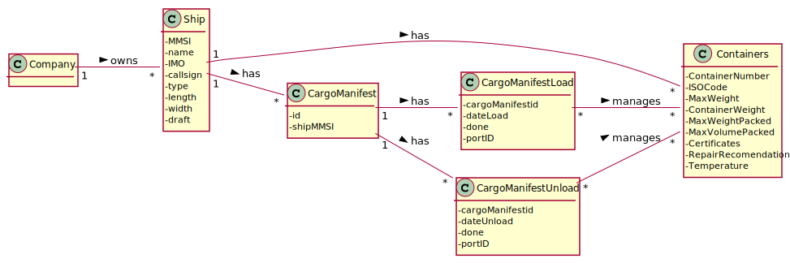

# US 315 - As a Port staff, given a position in the transport vehicle, I wish to know if a container is there or not

## 1. Requirements Engineering

### 1.1. User Story Description

As a Port staff, given a position in the transport vehicle, I wish to know if a container is there or not

### 1.2. Customer Specifications and Clarifications

From the client clarifications:

* Question: "Como é pedido na US314 para obtermos o numero de espaços livres/ocupados num veiculo de transporte, será possivel utilizar o metodo a US316 que calcula o numero de espaços ocupados num conjunto de posições?"
  * [Answer:](https://moodle.isep.ipp.pt/mod/forum/discuss.php?d=12844) "Espero que estejas a desenvolver esta parte do projecto em C e não em Java. Como tal, não tens métodos, mas sim funções!
    Depois, as duas USs têm propósitos claramente distintos. Na US314 tens de percorrer toda a matriz para determinar o total de slots ocupados. Na US316 recebes um conjunto de posições e tens de invocar necessariamente a função desenvolvida na US315 que determina se uma posição em particular está ou não ocupada.  "

### 1.3. Acceptance Criteria

* AC1:"The free/occupied position should be determined by an Assembly
  function that verifies the matrix filled with the containers’ IDs."
* AC2:"The function should return 1 if a container is there or 0, otherwise."

### 1.4. Found out Dependencies

### 1.5 Input and Output Data

Input Data

* Typed data:

Output Data

*  1 if the position is occupied or 0 if not
* (In)Success of the operation

### 1.6. System Sequence Diagram (SSD)

### 1.7 Other Relevant Remarks

## 2. OO Analysis

### 2.1. Relevant Domain Model Excerpt

### 2.2. Other Remarks

## 3. Design - User Story Realization

### 3.1. Sequence Diagram (SD)

## 3.2. Class Diagram (CD)

# 4. Tests

