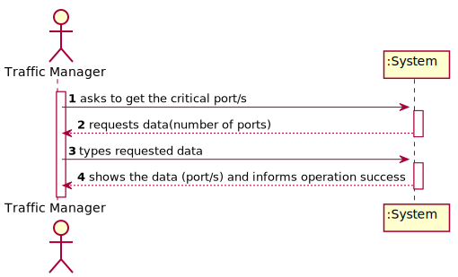
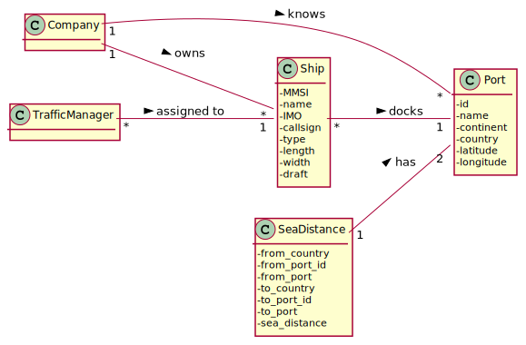
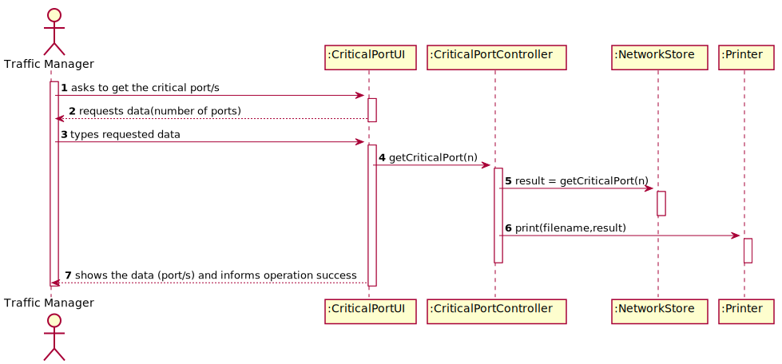
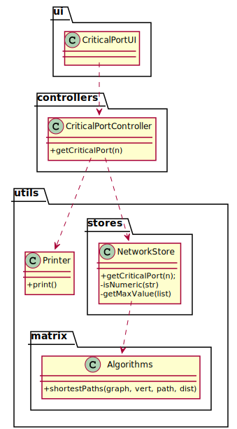

# US 401 - As a Traffic manager I wish to know which ports are more critical (have greater centrality) in this freight network.

## 1. Requirements Engineering

### 1.1. User Story Description

As a Traffic manager I wish to know which ports are more critical (have greater centrality) in this freight network.

### 1.2. Customer Specifications and Clarifications

From the client clarifications:

* Question: "Estou em dúvida se os paths para a US401 devem ter apenas em conta os ports ou também as cidades. Faz sentido ser só os ports, mas achei fazia sentido pedir a clarificação."
	* [Answer:](https://moodle.isep.ipp.pt/mod/forum/discuss.php?d=13792) "Os "paths" incluem todos os locais (cidades e portos), mas a contabilização é feita só para portos."
	
### 1.3. Acceptance Criteria

* AC1:"Return the n ports with greater centrality."
* AC2:"The centrality of a port is defined by the number of shortest paths that pass through it."

### 1.4. Found out Dependencies

* There is a dependency to "US301 - As a Traffic manager, I which to import data from countries, ports, borders and seadists files from the database to build a freight network." since the graph must exist to show the critical ports.

### 1.5 Input and Output Data

Input Data

* Typed data:
  	
	* number of critical ports

Output Data

* critical ports
* (In)Success of the operation

### 1.6. System Sequence Diagram (SSD)

### 1.7 Other Relevant Remarks

## 2. OO Analysis

### 2.1. Relevant Domain Model Excerpt

### 2.2. Other Remarks

## 3. Design - User Story Realization

### 3.1. Sequence Diagram (SD)

## 3.2. Class Diagram (CD)

# 4. Tests

**Test 1:** 

	@Test
    void getCriticalPort() throws IOException, SQLException {
        CriticalPortController cpc = new CriticalPortController(new Company());
        Assertions.assertFalse(cpc.getCriticalPort(2));
        Assertions.assertNotEquals(true, cpc.getCriticalPort(2));
        cpc = new CriticalPortController(App.getInstance().getCompany());
        App.getInstance().getCompany().getNetworkStore().createGraph(3);
        Assertions.assertTrue(cpc.getCriticalPort(2));
        Assertions.assertNotEquals(false, cpc.getCriticalPort(2));
    }

