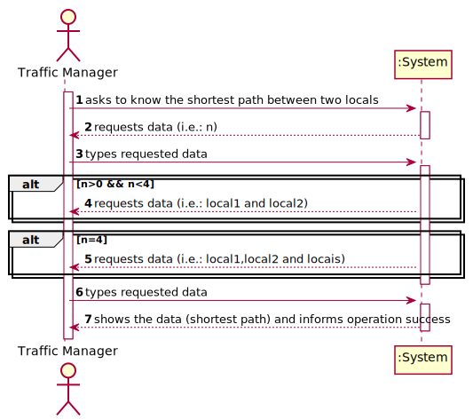
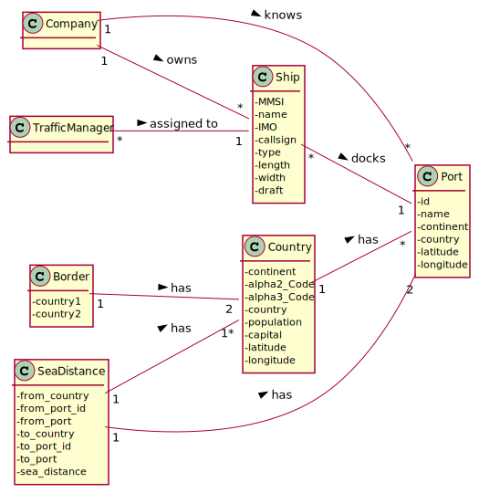
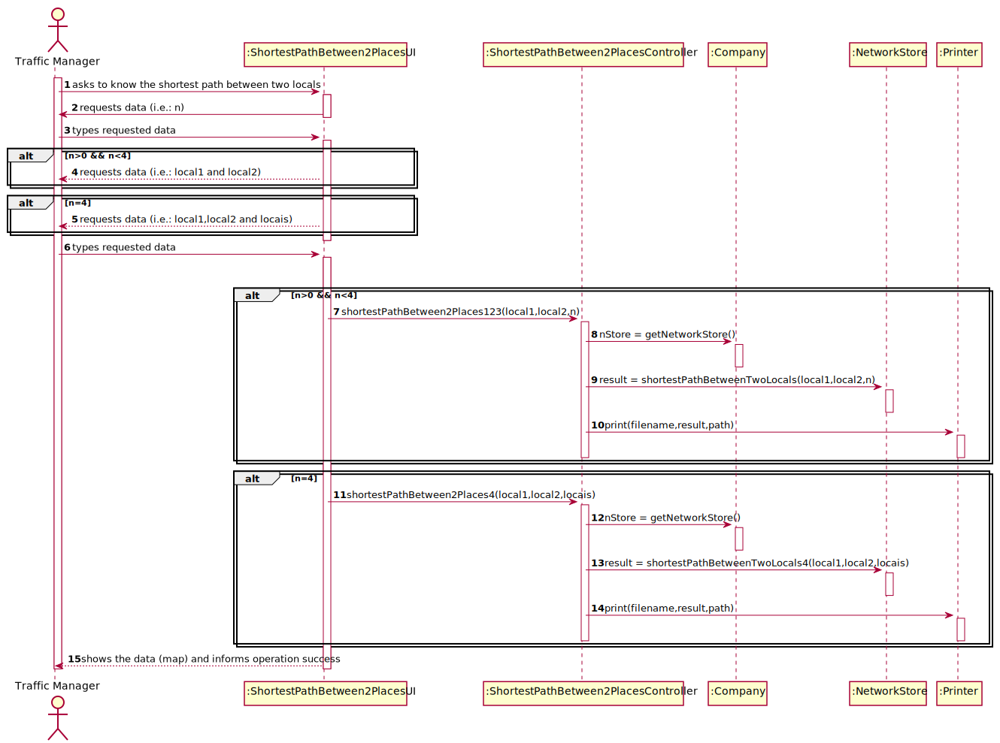
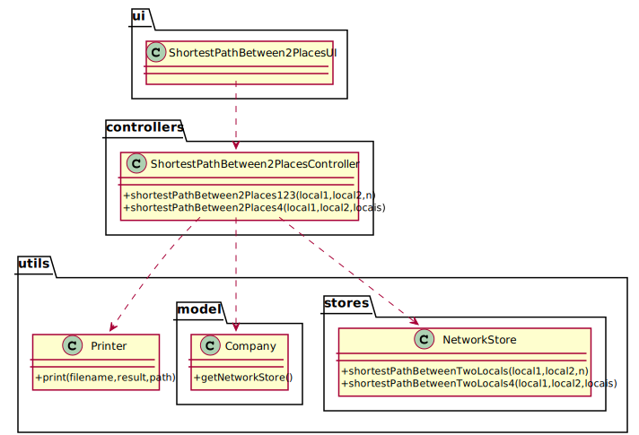

# US 402 - As a Traffic manager I wish to know the shortest path between two locals (city and/or port).

## 1. Requirements Engineering

### 1.1. User Story Description

As a Traffic manager I wish to know the shortest path between two locals (city and/or port).

### 1.2. Customer Specifications and Clarifications

From the client clarifications:

* Question: "On this US' acceptance criteria, it is said that the requested shortest path must "Obligatorily pass through n indicated places" if asked. Our question is, should there be a maximum number of indicated places for the Traffic Manager to select or not? Also regarding the types of path, should the program show a different path for each type or will the user select one out of the three?"
	* [Answer:](https://moodle.isep.ipp.pt/mod/forum/discuss.php?d=13695) "Não há um nº máximo de pontos intermédios, poderão ser n, mas claro está que este n só será exequível para números não muito elevados. Deverá implementar um método para cada tipo de caminho: terrestre, marítimo, misto."
	
* Question: "Should the program be able to get the shortest path port to port, by land? When you say "Obligatorily passing through n indicated places.", the user has to insert the number and the places that he want to pass, or just the number?"
	* [Answer:](https://moodle.isep.ipp.pt/mod/forum/discuss.php?d=13638) "Sim, pode haver um caminho entre dois portos, todo ele por terra. O user deve indicar os Locais intermédios."

* Question: "Qualquer caminho por terra tem de passar numa cidade ou pode passar apenas em Portos?"
	* [Answer:](https://moodle.isep.ipp.pt/mod/forum/discuss.php?d=13552) "Na US402 têm de implementar:a. um caminho terrestre (só inclui vias terrestres, pode ter início/fim em porto/cidade) b. um caminho marítimo (só inclui portos) c. um caminho terrestre ou marítimo (pode incluir cidades e portos) d. um caminho passando obrigatoriamente por n locais indicados (pode incluir cidades e portos)."
	

### 1.3. Acceptance Criteria

* AC1:"Land path (only includes land routes, may start/end in port/city)."
* AC2:"Maritime path (only includes ports)."
* AC3:"Land or sea path (may include cities and ports)."
* AC4:"Obligatorily passing through n indicated places."

### 1.4. Found out Dependencies

* There is a dependency to "US301 - As a Traffic manager, I which to import data from countries, ports, borders and seadists files from the database to build a freight network." since the graph must exist to show the shortest path.

### 1.5 Input and Output Data

Input Data

* Typed data:
  	
	* source location
	* end location
	* number of the path
	* obligatory places

Output Data

* shortest path
* (In)Success of the operation

### 1.6. System Sequence Diagram (SSD)

### 1.7 Other Relevant Remarks

## 2. OO Analysis

### 2.1. Relevant Domain Model Excerpt

### 2.2. Other Remarks

## 3. Design - User Story Realization

### 3.1. Sequence Diagram (SD)

## 3.2. Class Diagram (CD)

# 4. Tests

**Test 1:** 

	@Test
    void shortestPathBetween2Places() throws SQLException, IOException {
        FreightNetworkController fnc = new FreightNetworkController();
        fnc.freightNetwork(0);
        ShortestPathBetween2PlacesController spbp = new ShortestPathBetween2PlacesController();
        boolean result1=spbp.shortestPathBetween2Places123("14635","19473",2);
        boolean expected1=true;
        assertEquals(result1,expected1);

        ArrayList<String> locais= new ArrayList<>();
        locais.add("Athens");
        locais.add("Valetta");
        locais.add("10136");
        boolean result2=spbp.shortestPathBetween2Places4("Nicosia","Ankara",locais);
        boolean expected2=true;
        assertEquals(result2,expected2);
    }

