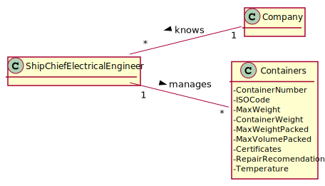

# US 411 - As a Ship Chief Electrical Engineer, I want to receive an alert when the current energy generation units are not enough to provide energy to all refrigerated containers at once.

## 1. Requirements Engineering

### 1.1. User Story Description

As a Ship Chief Electrical Engineer, I want to receive an alert when the current energy generation units are not enough to provide energy to all refrigerated containers at once.

### 1.2. Customer Specifications and Clarifications

From the client clarifications:

* Question: "Na US411 o valor das "current energy generation units" é um valor introduzido pelo utilizador? Se não, é suposto estar no manifesto de carga?"
	* [Answer:](https://moodle.isep.ipp.pt/mod/forum/discuss.php?d=13702) "Qualquer uma das opções é válida. O que interessa é ter algum grau de flexibilidade"

### 1.3. Acceptance Criteria

* AC1:"The needed calculations should be done in C."

### 1.4. Found out Dependencies

### 1.5 Input and Output Data

Input Data

Output Data

* alert
* (In)Success of the operation

### 1.7 Other Relevant Remarks

## 2. OO Analysis

### 2.1. Relevant Domain Model Excerpt

### 2.2. Other Remarks

