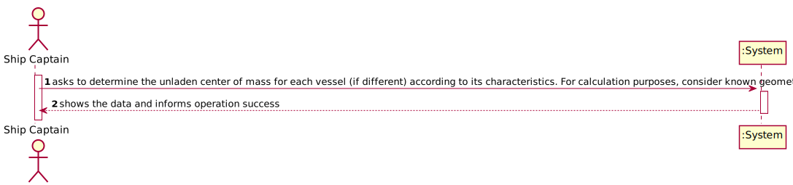
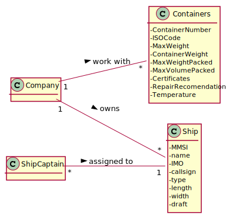
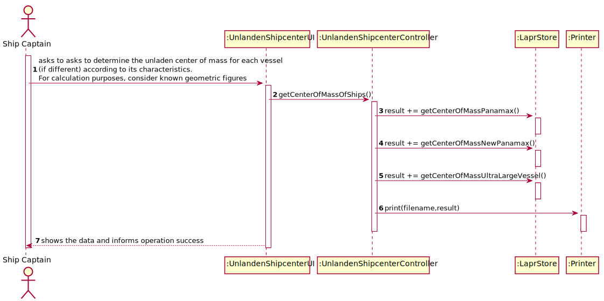
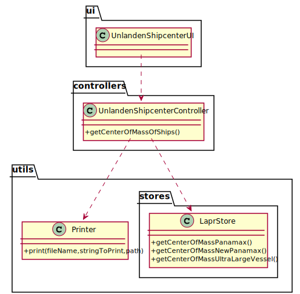

# US 418 - As the Ship Captain I want the determine the unladen center of mass for each vessel (if different) according to its characteristics. For calculation purposes, consider known geometric figures

## 1. Requirements Engineering

### 1.1. User Story Description

As the Ship Captain I want the determine the unladen center of mass for each vessel (if different) according to its characteristics. For calculation purposes, consider known geometric figures

### 1.2. Customer Specifications and Clarifications

From the client clarifications:

### 1.3. Acceptance Criteria

* AC1:"Make a sketch of the vessel's geometric figure."
* AC2:"Identify/choose a reference for the calculation."
* AC3:"Determine the center of mass for the different vessels (consider that the vessel is all made of the same material)."

### 1.4. Found out Dependencies

### 1.5 Input and Output Data

Input Data

* Typed Data:

Output Data

* Vessels center of mass
* (In)Success of the operation

### 1.6. System Sequence Diagram (SSD)

### 1.7 Other Relevant Remarks

## 2. OO Analysis

### 2.1. Relevant Domain Model Excerpt

### 2.2. Other Remarks

## 3. Design - User Story Realization

### 3.1. Sequence Diagram (SD)

## 3.2. Class Diagram (CD)

# 4. Tests

**Test 1:**
		
	@Test
    void getCenterOfMass() {
        LaprStore store = new LaprStore();

        String expected1 = "(39.506173,40.000000)";
        String expected2 = "(50.000000,50.000000)";
        String expected3 = "(100.492537,100.000000)";

        Assert.assertEquals(expected1,store.getCenterOfMass(20000000000.0,80));
        Assert.assertEquals(expected2,store.getCenterOfMass(50000000000.0,100));
        Assert.assertEquals(expected3,store.getCenterOfMass(100000000000.0,200));
    }

		

