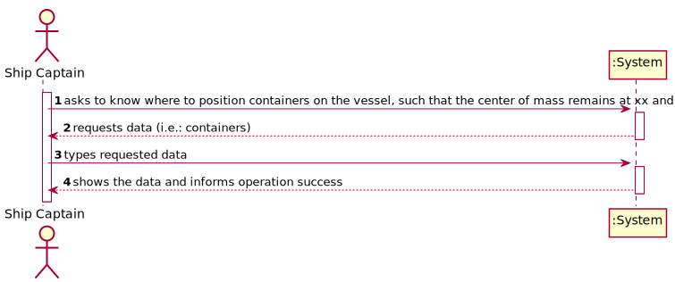
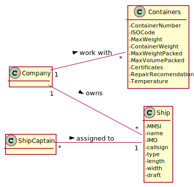
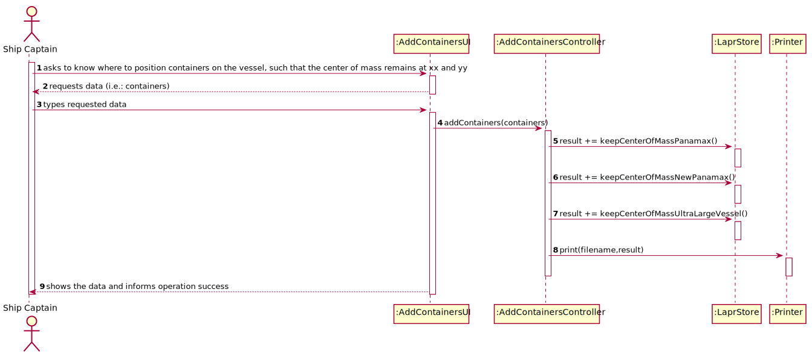
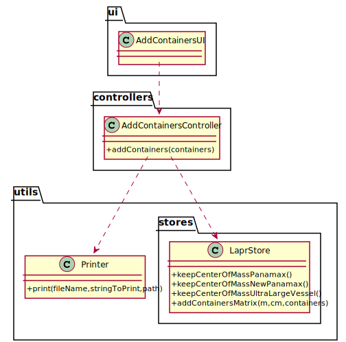

# US 419 - As the Ship Captain I want to know where to position, for example, one hundred (100) containers on the vessel, such that the center of mass remains at xx and yy, determined in the previous point.

## 1. Requirements Engineering

### 1.1. User Story Description

As the Ship Captain I want to know where to position, for example, one hundred (100) containers on the vessel, such that the center of mass remains at xx and yy, determined in the previous point.

### 1.2. Customer Specifications and Clarifications

From the client clarifications:

### 1.3. Acceptance Criteria

* AC1:"Identify the area/volume of a container and its center of mass. The distribution of the mass inside the container will be considered uniform."
* AC2:"Make a sketch of the distribution and loading on the vessel"
* AC3:"Calculate the center of mass of the sketch performed."

### 1.4. Found out Dependencies

* There is a dependency to "US418" so we can obtain the center of mass.

### 1.5 Input and Output Data

Input Data

* Typed data:
  	
	* number of containers

Output Data

* sketch
* (In)Success of the operation

### 1.6. System Sequence Diagram (SSD)

### 1.7 Other Relevant Remarks

## 2. OO Analysis

### 2.1. Relevant Domain Model Excerpt

### 2.2. Other Remarks

## 3. Design - User Story Realization

### 3.1. Sequence Diagram (SD)

## 3.2. Class Diagram (CD)

# 4. Tests

**Test 1:** 

	@Test
    void addContaienrs() throws IOException {
        AddContainersController addContainersController = new AddContainersController();
        assertTrue(addContainersController.addContainers(50));
    }

