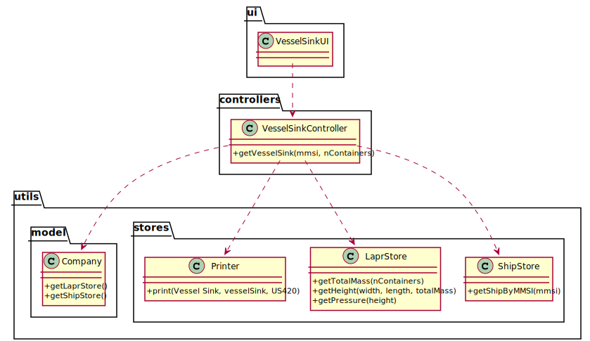

# US 420 - As the Ship Captain I want to know for a specific vessel, how much did the vessel sink, assuming that each container has half a ton of mass.

## 1. Requirements Engineering

### 1.1. User Story Description

As the Ship Captain I want to know for a specific vessel, how much did the vessel sink, assuming that each container has half a ton of mass.

### 1.2. Customer Specifications and Clarifications

From the client clarifications:

### 1.3. Acceptance Criteria

* AC1:"Determine the total mass placed on the vessel and the pressure exerted by it on the water."
* AC2:"Determine the difference in height that the vessel has suffered, above water level."

### 1.4. Found out Dependencies

### 1.5 Input and Output Data

Input Data

* Typed data:
  	
	* ship mmsi
	* number of containers

Output Data

* total mass placed on the vessel and the pressure exerted by it on the water.
* difference in height that the vessel has suffered, above water level.
* (In)Success of the operation

### 1.6. System Sequence Diagram (SSD)

### 1.7 Other Relevant Remarks

## 2. OO Analysis

### 2.1. Relevant Domain Model Excerpt

### 2.2. Other Remarks

## 3. Design - User Story Realization

### 3.1. Sequence Diagram (SD)

## 3.2. Class Diagram (CD)

# 4. Tests

**Test 1:** 

	@Test
    void getVesselSink() throws IOException {
        VesselSinkController vesselSinkController=new VesselSinkController();
        Ship ship = new Ship("123456789","shipo","IMO4545678","DR565","12345","90","40","10");
        ShipStore shipStore = new ShipStore();
        shipStore.saveShipInBST(ship);
        vesselSinkController.setShipStore(shipStore);
        List<Double> aux = vesselSinkController.getVesselSink("123456789", 3000);
        String result = String.format("Total mass placed on the vessel: %.2fkg %nDifference in height that the vessel has suffered: %.2fm %nPressure exerted: %.2fPa", aux.get(0),aux.get(1),aux.get(2));
        String expected = "Total mass placed on the vessel: 1500000.00kg \nDifference in height that the vessel has suffered: 0.40m \nPressure exerted: 4083.33Pa";
        Assertions.assertEquals(expected,result);
    }
		

